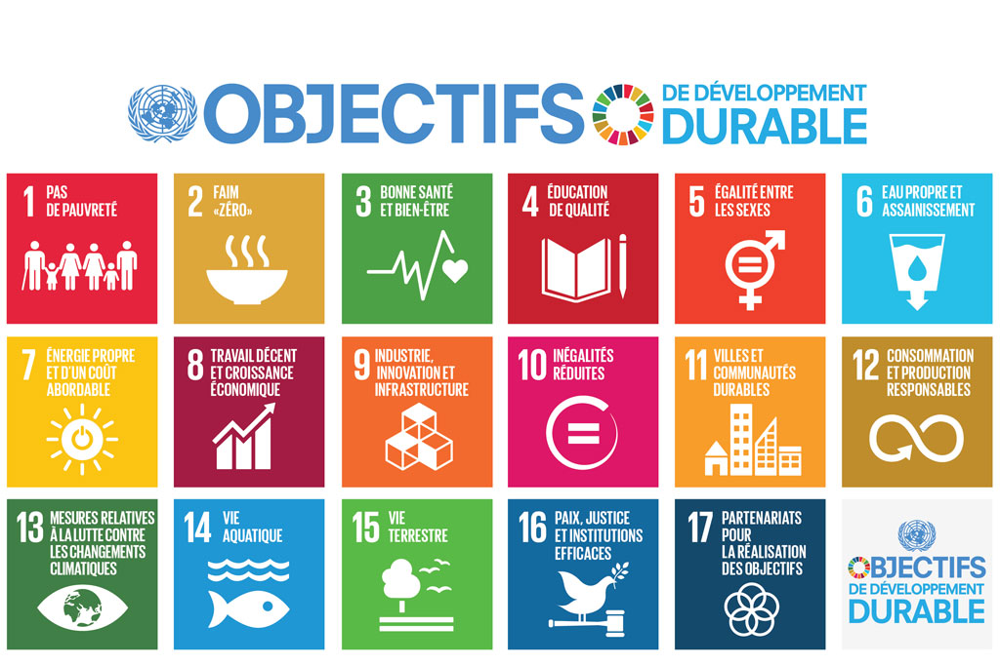
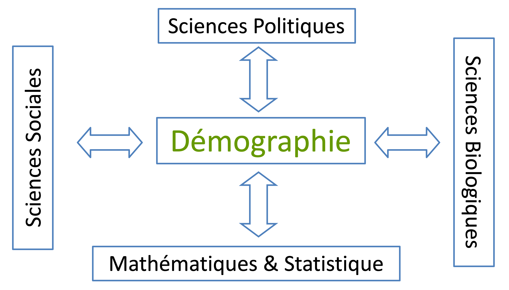

## Plan de présentation

1. Qui suis-je?
2. Questions en démographie
3. Présentation du cours

Qui suis-je?
=============================

## Formations

- Doctorat en Démographie, Université de Montréal
- Maîtrise en Économie du développement, Centre d’Études et de Recherche sur le Développement International (CERDI), France
- Ingénieur des Travaux Statistiques, Ecole Nationale de Statistiques et d’Économie Appliquées (ENSEA), Côte d'Ivoire
- Diplôme de mathématiques, Université de Lomé (Togo)

## Expériences professionnelles

- University of Cape Town (2013 - 2018)
- Université du Québec à Montréal (UQAM) depuis juillet 2018

## Intérêts de recherche

1. Démographie / Sociologie
    - Dynamiques familiales en Afrique sub-Saharienne (ASS)
    - Emploi des femmes et fécondités (ASS)
    - Population immigrantes au Canada
    - Transition démographique

## Intérêts de recherche

2. Santé publique
    - Recours aux soins de santé (ASS)
    - Mortalité infantile et maternelle (ASS)
    - Santé de la reproduction

## Intérêts de recherche

3. Méthodes quantitatives et computationnelles
    - Causalité et ses biais
    - Grands intérêts pour les Big data
    - Vos projets m'intéressent :)

## Intérêts centrés sur les objectifs de développement durable

Questions en démographie
================================

## Combien sommes-nous sur la planète?

http://galen.metapath.org/popclk.html

## Objectifs généraux

>- Familiariser les étudiants avec les principaux phénomènes démographiques et leurs mesures

>- Tenter de comprendre la «société»

>- Affiner l'opinion des étudiants sur le devenir de l’humanité et comprendre les moyens dont nous disposons pour cela

## Objectifs spécifiques

>-	Interpréter les principaux indicateurs décrivant les phénomènes démographiques (mortalité, nuptialité, fécondité et migration) ;

>-	Acquérir une bonne compréhension de ces phénomènes démographiques et leur rapport avec les problèmes sociaux ;

>-	Comprendre et porter un regard critique sur les phénomènes démographiques et les problèmes sociaux de différents contextes géographiques ;

>- De calculer certains de ces indicateurs en partant des données habituellement fournies par les sources les plus classiquement utilisées dans ce but.

## Questions en démographie

Vallin, 1991

> 1. Sommes-nous capables de produire assez face à cette énorme croissance de population devant nous?

> 2. Sommes-nous capable de répartir plus équitablement cette production?

> 3. Sommes-nous capables de gérer les flux migratoires énormes qui ne manqueront pas de résulter de cette situation démographique?

> 4. Sommes-nous capables d’atteindre, ou presque, ces objectifs sans détruire la planète, sans scier la branche sur laquelle nous sommes assis?

> 5. Quel nouvel ordre politique mondial imaginer pour tenter de répondre à ces questions?

<!--La technicité nous fait oublier l'essentiel: L'explication des phénomènes ainsi mesurés et l'appréciation de leurs conséquences sur les autres aspects de la vie économique et sociale.
La quête scientifique n'a pas uniquement pour fin de nous faire connaître l'univers et les lois qui le régissent, elle tend aussi à nous en donner le mode d'emploi.

p. XVI: Le demographe, pour decrire et expliquer la dynamique de la population,
ne peut done se limiter aux seules variables demographiques. II doit necessairement
prendre en compte dans son cadre conceptuel l' ensemble des facteurs,
individuels et collectifs, qui peuvent influencer les trajectoires demographiques
indi viduelles et done celle de la population, objet de l'etude.

Notre societe conna1t aujourd'hui de rapides changements,
qui, en penalisant plus que d' autres certain es aires geographiques de
la planete ou certains groupes de population, engendrent de nouvelles inegalites
(sociales, economiques et demographiques) ou en reveillent d' anciennes.
Ainsi, face aux consequences de Ia rapidite avec laquelle surviennent les
changements sociaux et culturels, les grandes innovations technologiques,
l' affi􀄒mation toujours plus nette de l 'economie de n1arche, le deperissement
de I' Etat Providence, les process us de globalisation, les capacites d' adaptation
aux nouvelles situations different d'une population a l'autre, me1ne a
l' interieur de chaque pays, selon Jeurs cultures, leurs mo yens d' acces aux
technologies nouvelles et, bien sur, leurs performances econo1niques.

-->

## Questions en démographie
Preston, 1990

> 1. Étude prospective sur la population

> 2. Problèmes d’équité

> 3. Relation entre population et environnement

> 4. Migration internationale volontaire

> 5. Changement dans la famille et de la fécondité

> 6. Vieillissement

> 7. Modèles de maladie, d’incapacité et de décès

<!-- (Pouvons-nous répondre à ces questions, à ces intérogations qui sont au coeur de l’action politique aujourd’hui sans faire appel à d’autres disciplines. Pouvons-nous connaître, comprendre, prévoir, maîtriser l’évolution de la population en restant fermer dans notre cocon?). Ceci permet aussi d'ajouter un commentaire [//]: -->

## Questions en démographie
Radio Canada, 2019

https://ici.radio-canada.ca/nouvelle/1445573/surpopulation-environnement-rechauffement-gaz-effet-serre

## En conclusion, une science au coeur des autres sciences

<!-- Connaître, comprendre, prévoir, maîtriser l'évolution de la population... peut-on le faire sans faire appel à d'autres disciplines: histoire, géographie, économie, sociologie, psychologie, médecine, biologie, génétique... ? Certes non. Mais, ce n'est pas pour autant que le démographe doit tout embrasser.
Question: En quoi la démographie est utile pour le sociologue?

-->

## En conclusion, une science au coeur des autres sciences

"It has come to a point where a senior professor can say that he studied demography because it meant that he could earn a PhD in Sociology without ever reading Weber, Marx, or Durkheim . . . and no one laughs." (Johnson-Hanks et al. 2011, p.vii, Undestanding family change and variation)"

"On en est arrivé à un point où un professeur chevronné peut dire qu'il a étudié la démographie parce que cela lui permettait d'obtenir un doctorat en sociologie sans jamais avoir lu Weber, Marx ou Durkheim ... et personne ne rit."

## En conclusion, une science au coeur des autres sciences

“ Parmi toutes les sciences de l’Homme, c’est la démographie qui peut le moins se passer des autres sciences. (…) la biologie, la sociologie, la psychologie; (…) l’économie politique pour autant que l’être humain est pendant une période de sa vie un producteur et pendant toute sa vie un consommateur, l’ethnologie (…), l’écologie (…), la philosophie pour autant que les évènements démographiques ont un sens ontologique évident. Les mathématiques et la statistique (…), la technologie (…), la géographie, la médecine, l’histoire, le droit, la criminologie, la théologie, la morale, les sciences politiques, la pédagogie se rencontrent toutes un jour ou l’autre avec la démographie." Jean Bourgeois-Pichat, 1962.

## Importance des mathématiques

> 1. Revoir les notions de base du CEGEP

>  - Opérations, signe, utilisation des parenthèses 
>  - Fractions et puissances
>  - Équations du premier degré
>    - 2x + 1 = 4

> 2. Pour résoudre un problème mathématique:

>  - Traduire la question de manière cohérente: la poser si possible sous “forme mathématique”
>  - Poser les hypothèses et leurs traductions
>  - Résoudre le problème

> 3. Utilisation du logiciel EXCEL: http://www.freelang.com/mag/informatique_excel.html

## Importance pour le sociologue

Présentation du syllabus
====================================

## Calendrier

## Devoirs (20%)

- Voir calendrier
- Application du cours et résumé de lecture
- Travail en groupe permis si justifié
- 2 devoirs au total
- Les devoirs comptent pour 20% de la note finale

## Débats (présentation et soumission du travail) (20%)

- Présentation orale en équipe (note individuelle) (10%)
- Travail rédigé soumis (note individuelle)    (10%)

## Examens   (50%)

- Intra : compte pour 20%
- Final : compte pour 30%

- Organisation
    - Questions à Choix multiples (plus possiblement questions ouvertes)
    - Sans note ou documentation, 
    - Seule la calculatrice est permise

## Participation (10%)

- Résumé des articles de chaque séances (à envoyer au plus tard à la veille du cours)
- Participation active en classe
- 10% de la note finale. 

## Matériels de cours

- Livre de cours

    -	Catherine Rollet, Introduction à la démographie (Armand Colin, 2015, 128 p.)
    -	Céline Clément et Carole Brugeilles, Introduction à la démographie (Armand Colin, 2020, 263p.)  
    -	Frank Trovato, Canada’s Population in a Global Context: An Introduction to Social Demography (Second Edition), (Oxford, 2015) 
    -	Annie Vidal, Démographie : Éléments d’analyse et évolution du peuplement humain (Presses Universitaires de Grenoble, 2002, 192 p.).

- Recueil de texte (à télécharger par vous même si disponible en ligne)

## Disponibilités

- Mes heures de bureau sont:

    - Mardi (Zoom) : 12h30 - 13h30
    - Mercredi (Présence) : 13h - 14h

>- Si vous avez besoin de planifier une heure particulière pour me voir, contactez-moi par Slack ou par courriel électronique.

>- Privilégier Slack pour les interactions 

## Ressources

>- Site super intéressant
  
  >- https://ourworldindata.org/
  
> - ONU, Division de la population : 
  >- www.un.org/unpp/
  >- http://data.un.org

>- US Census Bureau
  >- www.census.gov

>- INED
  >- www.ined.fr

>- Statistique Canada
  >- www.statcan.gc.ca

