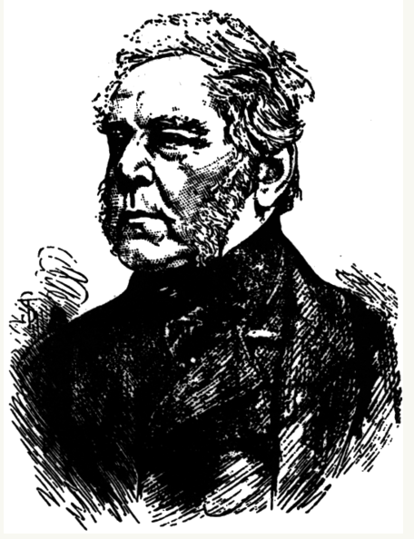
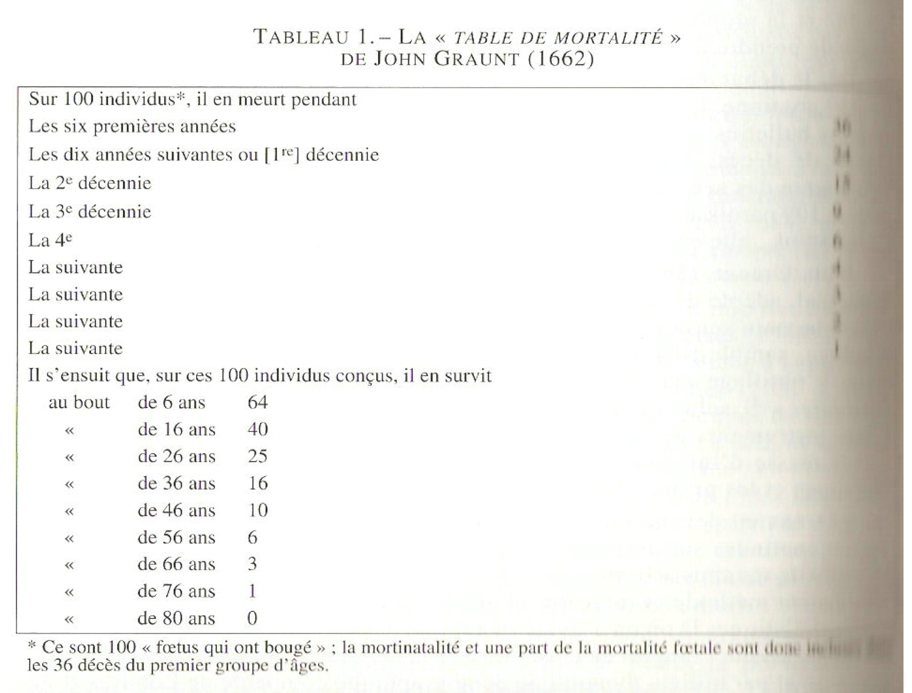
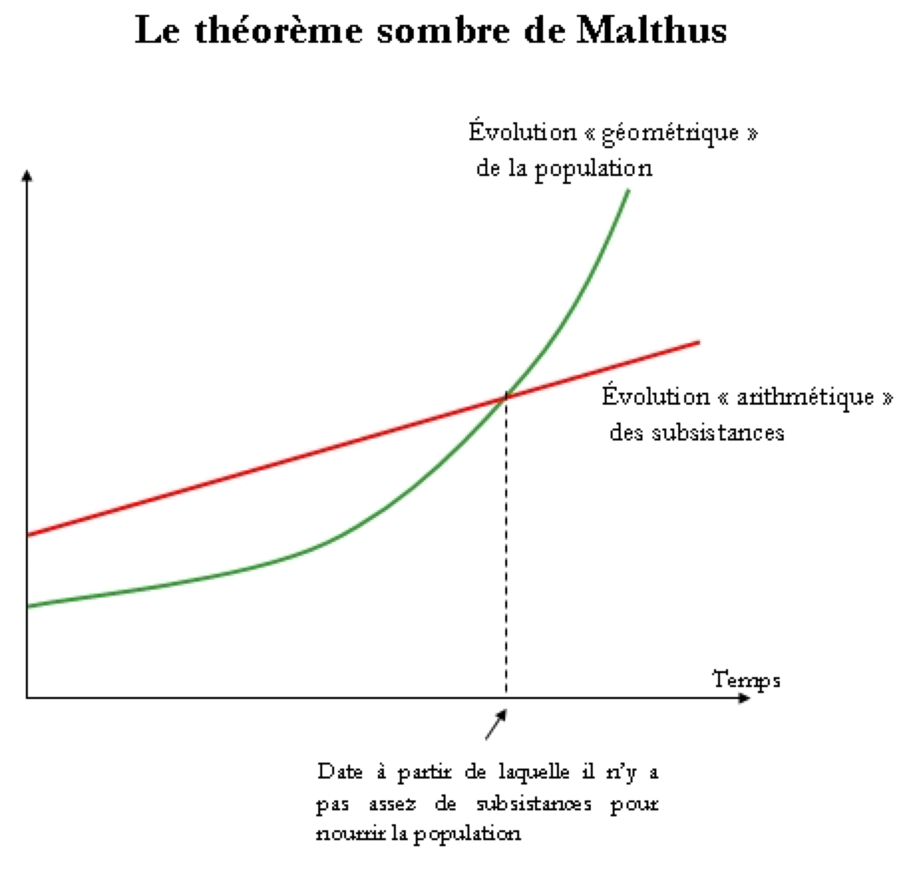
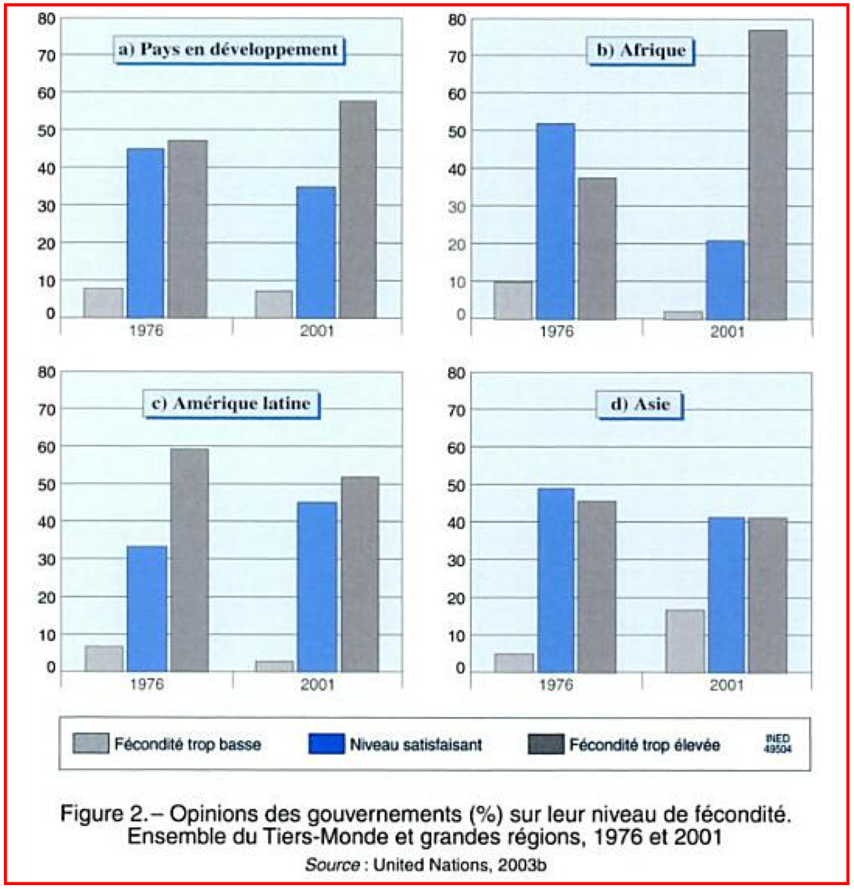

## Plan de présentation

1. Définition
2. Histoire de la discipline
3. Conférences sur la population
4. Pour la semaine prochaine

Définition 
===================================

## Définition

> - Etymologie, du grec ancien
>    - Graphos : discipline qui décrit
>    - Demos : population

> - démographie = une science descriptive

## Définition

> - Achille Guillard (1855) – inventeur du mot démographie dans son ouvrage "Éléments de statistique humaine, ou démographie comparée"

<!-- ouvrage relève plus du pamphlet idéologique que de l'exposé scientifique, et même s'il en donne une définition trop restricive, reconnaissons lui au moins le mérite d'avoir inenté le mot qui désigne aujourd'hui la discipline.

-->

> - "Connaissance mathématique des populations, de leurs mouvements généraux, de leur état physique, civil, intellectuel et moral." (Dans "Éléments de statistique humaine ou démographie comparée")

> - démographie = étude statistique des populations humaines

## Définition 

- Nations Unies (1958) 

"Science ayant pour objet l’étude des $\color{red}{\textbf{populations	humaines}}$, et traitant de leur $\color{red}{\textbf{dimension}}$, de leur $\color{red}{\textbf{structure}}$, de leur $\color{red}{\textbf{évolution}}$ et de leurs caractères généraux envisagés principalement d’un $\color{red}{\textbf{point de vue quantitatif}}$"

<!--Une population est une coupe transversale a un moment donne d'une
multitude de trajectoires de vie individuelles. Au cours d'une periode de
temps, des enfants naissent dans cette population et des personnes immigrent,
tan dis que d' autres meurent ou emigrent. L' effectif de la population augmentera
ou diminuera a la suite de ces evenements. Une bonne comprehension du
mouvement de la population au cours du temps necessite done de savoir combien
de personnes sont nees pendant la periode consideree, combien sont
mortes et combien ont emigre ou immigre (comme on le verra plus precisement
au chapitre 3). (Vallin, page XIV) -->

## Définition 

\begin{columns}
\begin{column}{0.5\textwidth}

- État

   1. Dimension

    - Taille

   2. Composition

    - Age

    - Sexe, etc

<!--La structure demographique a un instant du temps dependra des lors des caracteristiques des indi vidus composant la population a cet instant-la, telles que leur age, leur etat matrimonial, leur sexe, etc.-->

\end{column}
\begin{column}{0.5\textwidth}

> - Facteurs de changements démographique
    
    - Fécondité/mariage
    
    - Mortalité/santé
    
    - Migration 
    
<!--Le mouvement demographique, quant a lui, decoulera du nombre de naissances, de deces, d' emigrations et d'immigrations survenant dans cette population au cours d'une periode de temps.-->

\end{column}
\end{columns}

<!--La variete de structures demographiques possibles est ainsi infinie selon
le nombre de caracteristiques retenues. Les individus ne different pas seulement
en fonction de leur age ou de leur etat matrimonial, mais aussi par leurs
habitudes alimentaires, leurs gouts musicaux, la couleur de leurs cheveux ou
de leurs yeux, etc. Ces caracteristiques, et les structures associees, ne sont
pas toutes utiles pour le demographe; seules les caracteristiques pouvant influencer
le mouvement demographique doivent etre prises en compte. C'est
ainsi que la fecondite, la mortalite et la migration varient selon l' age, le sexe,
l'etat matrimonial de l'individu; mais le degre d'instruction, le groupe social
ou ethnique, ont aussi frequemment une incidence sur la fecondite d'un individu ou sur sa durée de vie. par contre, le fait d'aimer les tulipes ou la musique de Sibelius n'a probablement aucun effet sur les composantes du mouvement démographique. (Vallin, page XIV) -->

Histoire de la démographie
===================================

## 1662 : Opuscule de John Graunt

## Autres contributions de John Graunt

>  - Calcul du nombre des femmes fécondes
>  - Estimation du nombre d’habitants de Londres
>  - Estimation de la durée de vie moyenne
>  - Ébauche de la Table de Mortalité, etc.

## 1693 : Publication de la première Table de Mortalité (Edmud Halley)

> - Première étude démographique (au sens scientifique) à partir des relevés de décès
> -  Distribution réelle des décès par âge

## 1693 : Publication de la première Table de Mortalité (Edmud Halley)

## Formalisation de la table de mortalité

> - 1746 : Formalisation du principe et du contenu de la Table de Mortalité (Antoine Deparcieux)
> - 1760 : Calcul du gain en vie moyenne suite à l’élimination d’une cause de décès (Daniel Bernoulli)
 

## 1798 : Essai de Robert Malthus

>- Robert Malthus (1798), Essay on the Principle of Population

>   - Point de vue pessimiste sur la croissance démographique rapide

>   - Population croît à un rythme géométrique

>   - Ressources croît à un rythme arithmétique

## 1798 : Essai de Robert Malthus

"Je dis que le pouvoir multiplicateur de la population est infiniment plus grand que le pouvoir qu’à la terre de produire la subsistance de l’homme. Si elle n’est pas freinée, la population s’accroît en progression géométrique. Les subsistances ne s’accroissent qu’en progression arithmétique."

<!-- copié dans https://www.matierevolution.fr/spip.php?article1581 -->

## 1798 : Essai de Robert Malthus

## 1798 : Essai de Robert Malthus

"Un homme qui est né dans un monde déjà possédé, s’il ne lui est pas possible d’obtenir de ses parents les subsistances qu’il peut justement leur demander, et si la société n’a nul besoin de son travail, n’a aucun droit de réclamer la moindre part de nourriture, et, en réalité, il est de trop. Au grand banquet de la nature, il n’y a point de couvert vacant pour lui ; elle lui ordonne de s’en aller, et elle ne tardera pas elle-même à mettre son ordre à exécution, s’il ne peut recourir à la compassion de quelques convives du banquet. Si ceux-ci se serrent pour lui faire place, d’autres intrus se présentent aussitôt, réclamant les mêmes faveurs. La nouvelle qu’il y a des aliments pour tous ceux qui arrivent remplit la salle de nombreux postulants. L’ordre et l’harmonie du festin sont troublés, l’abondance qui régnait précédemment se change en disette, et la joie des convives est anéantie par le spectacle de la misère et de la pénurie qui sévissent a dans toutes les parties de la salle, et par les clameurs importunes de ceux qui sont, à juste titre, furieux de ne pas trouver les aliments qu’on leur avait fait espérer."

## 1798 : Essai de Robert Malthus

Réponse des anti malthusiens et principalement de Karl Marx : 

"La misère ouvrière est une conséquence et une nécessité du mode de production capitaliste"

## 18e au 20e siècle

>- 18e siècle : Avancée dans l’organisation du dénombrement de la population
>- 19e siècle : Meilleure connaissance des faits de population au 19ième siècle
>- 20e siècle : Naissance de la démographie moderne
>  - Mécanismes de la dynamique démographique: ouvrage de Alfred Lotka (1939) "dynamique des populations"
>  - Analyse démographique
>  - Théorie des populations
>  - Transition démographique
>  - Comportements

<!-- C'est en effet la theeorie de Lotka qui est au coeur de la démographie, même si cette dernière a aussi pour objet d'en étudier les tenants et les aboutissants, en rapport avec les différents aspects qualitatifs et quantitatifs, tant au niveau individuel qu'à celui des sociétés." -->

Quelques conférences marquantes
==========================================

## Conférence de Bucarest (1974)

>- Affrontement entre les pays du Nord et du Sud sur la limitation des naissances

>- Réponse du tiers monde «le meilleur contraceptif, c’est le développement»

>- «Les variables démographiques étaient dépendantes du développement et de la justice sociale»

## Conférence de Mexico (1984) : Débat en détail sur la condition des femmes, de la morbidité et de la mortalité

>- Baisse de la croissance démographique grâce à la croissance économique et la planification familiale

>- Vieillissement et dénatalité font surface en occident

>- Vive discussion sur l’avortement

## Conférence du Caire (1994): De la planification familiale à la santé de la reproduction

>- Questions démographiques, économiques et place de la femme

>- Le bien-être et le droit à l’égalité de la femme deviennent une question en soi

 http://archives.radio-canada.ca/sante/sante_publique/clips/12945/

## Opinion des gouvernements sur leur niveau de fécondité 

## Conclusion

1. Approches
  - Observation
  - Mesure
  - Analyse

## Conclusion

1. Approches
  - Observation
  - Mesure
  - Analyse

2. Trois disciplines en 1
  - Mortalité
  - Fécondité
  - Migration

## Question sur le texte de Vallin

1. Expliquer pourquoi l'homme étant un animal, la démographie ne fait pas partie des sciences biologiques? (Vallin, page X)

2. Citer les trois raisons pour lesquelles le démographe doit incluire l'étude de la migration dans l'étude des dynamiques démograhiques (Vallin, page XII)

3. Qu'entend-on nous par "une population peut rajeunir" alors quon sait qu'un individu ne peut jamais rajeunir. (Vallin, page XIV)

4. Dans quel cas une caractéristique a un sens d'un point de vue démographique? (Vallin, page XV)

5. Quels sont les grands défis dont parlent Vallin dans son texte. Pour chaque défis, dites s'il s'est accru ou s'il s'est amoindri. Appuyer vos répondes par des exemples précis et sources scientifiques. (Vallin, page XVI)

Pour la semaine prochaine
=========================

## A faire
- Lecture de cette semaine: Vidal, page 5 à 12
- Lecture pour la semaine prochaine: Vidal, Chapitre 1, page 13 à 37

## Résumé à déposer sur Moodle

Tabutin: les systèmes de collectes des données en démographie

https://github.com/visseho/SOC1060_demographie/blob/main/Seance2_Sources_Donn%C3%A9es/Lectures/Tabutin_2006_Le_systeme_de_collecte_des_donn%C3%A9es.pdf

