## Plan de présentation

A. Les données usuelles des démographes

1. État Civil

2. Recensement

3. Registre de population

4. Enquêtes 

5. Les autres sources d’informations

B. Les données digitales

C. La qualité des données

Introduction
===================================

## Rappel: questions au coeur de la démographie

1. Questions sur la mortalité

- Quels sont les facteurs qui expliquent les différences en espérance de vie dans le monde?

2. Questions sur la santé et le vieillissement

- Est-ce que nous allons vivre plus longtemps en santé?

3. Questions sur la fécondité et la famille

- Est-ce que la fécondité continuera de baisser ?

4. Questions sur la croissance démographique et l’environnement

- L’humanité est-elle menacée par l’explosion démographique du "tiers monde"?

## Les données : pour quel dessein?

- Pour répondre à ces questions, il y a nécessité de disposer de données fiables 

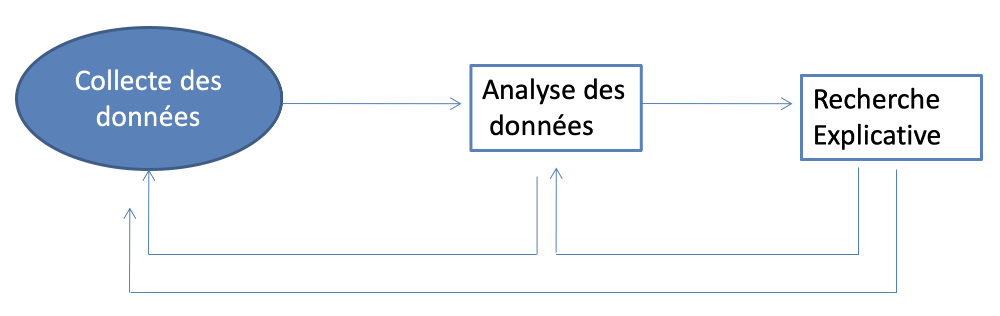

A. Les données usuelles des démographes
==============================================

## Deux manières de collecter l'information

> 1. Ponctuelle : Reportage des événements à un moment donné (A)

>
- Recensement
- Enquêtes à passage unique

> 2. Continue : Saisie des événements à plusieurs moments pour le même groupe ou population

>
 - État civil
- Registres de population
- Enquêtes à passages répétés
- Observatoires de population
- Registres administratifs et médicaux

État civil
===================================

## Définition

«Un système d’enregistrement $\color{red}{\textbf{continu}}$, $\color{red}{\textbf{permanent}}$ et $\color{red}{\textbf{obligatoire}}$ des **faits d’état civil** (naissances, décès, mariages) et de leurs caractéristiques, ainsi que des **événements pouvant modifier la situation d’une personne** (divorces, séparations, annulations, adoptions…). » (D. Tabutin, 1984)

## Forme moderne des registres paroissiaux

- Nés dans l'Europe chrétienne au milieu du 16e siècle de la volonté de faire respecter les sacrements (baptêmes, mariages et sépultures)

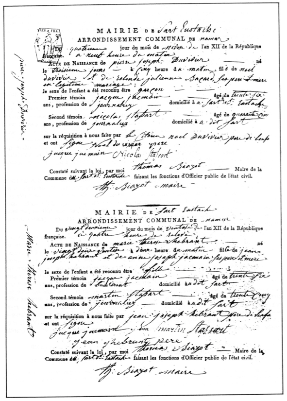

## Caractéristiques

1. Caractère obligatoire: l’enregistrement des faits d’état civil est obligatoire par la loi.

>
2. Caractère national 
Exceptions: Canada, États-Unis, Argentine, Australie, où l’état civil relève des autorités des États ou Provinces.

## Avantages

1. Permet de suivre l’évolution de la Population

>
2. Délai relativement court entre l’événement et son enregistrement

## Problèmes

1. Saisit mal le mariage et le divorce du fait des unions (ou cohabitations), qui sont par définition non enregistrées

>
2. Exclut les migrations internes

>
3. Variabilité des définitions:
légales des événements (ex.: mort-né, naissance vivante)
des autres concepts de base (ex.: causes de décès, poids de naissance)

## Exemple : État civil au Canada

1. Le premier acte date du 24 octobre 1621 : Paroisse Notre-Dame de Québec

2. Entente entre le gouvernement du Canada et les gouvernements provinciaux: Quelques différences persistent dans les éléments déclarés par chacune des provinces

3. Depuis 1944, événements classés selon le lieu de résidence déclaré, sauf les mariages (selon le lieu de l’événement)

4. Contrôle de la qualité des déclarations par les provinces et territoires et par Statistique Canada

## Exemple : État civil au Canada - les types de déclaration

- Naissances vivantes
- Décès
- Mort foetale : mort d'un foetus après 20 semaines de grossesse
- Avortement thérapeutique
- Mariage
- Divorce
- Séparation légale
- Annulation (de mariage)
- Adoption

<!--
La MORT FÉTALE est la mort avant l'expulsion ou l'extraction complète du produit de la conception de sa mère, quelle que soit la durée de la période de gestation. La mort est indiquée par le fait qu'après cette séparation, le fœtus ne respire pas et ne présente aucun autre signe de vie, tel que les battements du cœur, la pulsation du cordon ombilical ou le mouvement défini des muscles volontaires.
-->

## Exemple : État civil au Canada

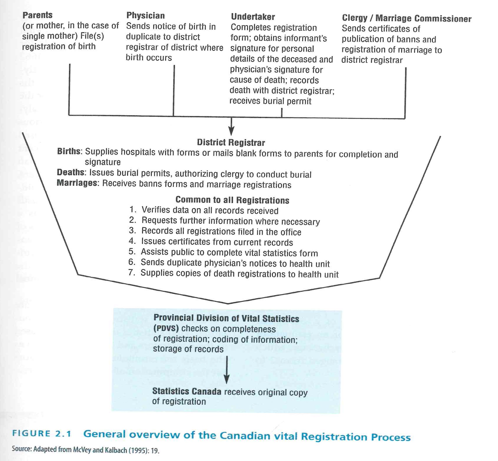

## Une inégale couverture

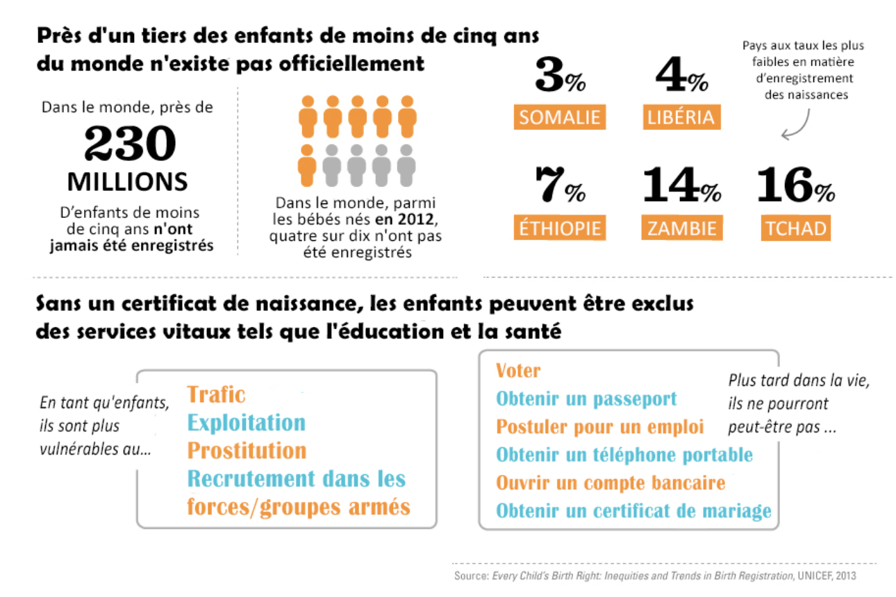

<!--
carte 
https://www.globalfinancingfacility.org/fr/investir-dans-les-syst%C3%A8mes-denregistrement-et-de-statistiques-de-l%C3%A9tat-civil-afin-d%E2%80%99am%C3%A9liorer-les

## Une inégale couverture

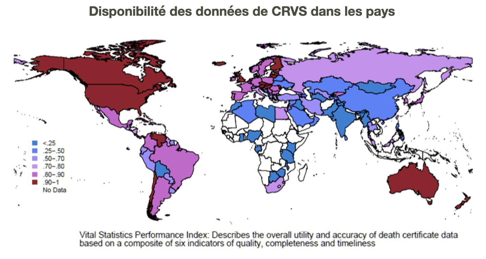
-->

Recensement
==================

## Définition

Opération ayant pour objet de recueillir des informations sur $\color{red}{\textbf{tous les habitants}}$ d’un pays ou d’un territoire indiqué à un moment donné.

## Population de droit, population de fait
>
- Population totale : quelle définition ?
- Présente (ou de fait) = physiquement présente au moment de l’observation
>
- Légale (ou de droit) = les individus ayant leur résidence habituelle (c.a.d. qui d’habitude y mangent et dorment) au lieu de l’observation
>
- Population présente = population légale + personnes temporairement absentes de leur résidence - personnes de passage

<!--
Le problème qui se pose pour la population totale est celui de la définition retenue. Dans le recensements de population, on distingue généralement la population présente (ou de fait), c’est-à-dire physiquement présente au moment de l’observation, et la population légale (ou de droit), c’est-à-dire les individus ayant leur résidence habituelle au lieu de l’observation.

-->

## Définition 

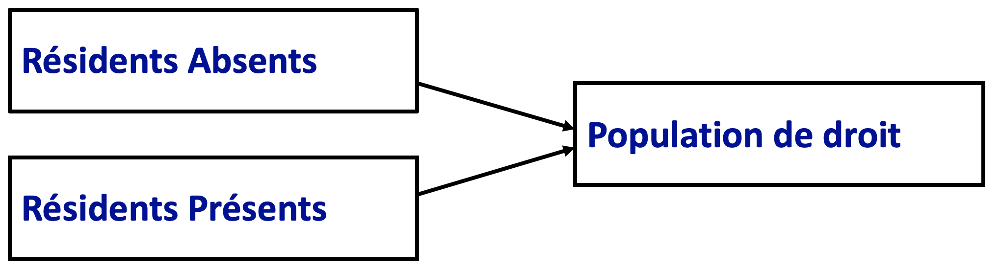

## Définition 

## Raison d'être:

>
https://www.statcan.gc.ca/fra/rb/video/decisions-donnees-recensement

## Raison d'être:

1. Tracer le profil statistique du pays et de sa population
2. Déterminer le montant des impôts
3. Outil de toute planification socio-économique
4. Base pour la recherche académique et base de sondage

## Les 4 grands principes du recensement

- $\color{red}{\textbf{Exhaustivité}}$ : Il doit toucher tous les habitants d’un territoire donné;
 
- $\color{red}{\textbf{Dénombrement individuel}}$ : Il recueille des informations sur chaque individu;

- $\color{red}{\textbf{Simultanéité}}$ : L’information recueillie porte sur la situation à une seule et même date et pour ce faire l’opération doit être exécutée en quelques jours; 

- $\color{red}{\textbf{Périodicité}}$ : le recensement doit être répété à intervalles réguliers.

## Question du recensement du Canada

https://www12.statcan.gc.ca/nhs-enm/2016/ref/questionnaires/questions-fra.cfm

## Avantages

1. $\color{red}{\textbf{Couverture exhaustive}}$ : statistiques possibles à toutes les échelles géographiques, comparaison entre sous-groupes; 
>
2. Données de structure mais aussi sur la $\color{red}{\textbf{dynamique démographique}}$ (ajout de questions spécifiques) ;
>
3. Outil pour démographe : base de sondage
>
4. Outil pour gestion publique : aménagement du territoire, gestion économique et sociale

## Points faibles

1. Coût considérable
>
2. Délai de publication et contrainte d’accès aux données
>
3.Lourdeur de l’organisation : limites dans la formation des agents recenseurs, dans la qualité des données, la couverture des différentes sous-population
>
4. Limité dans le contenu → utilité social?
	- Exemple: Pas d’information sur les histoires migratoires ou professionnelles des individus

## Points faibles
>
5. Erreurs de dénombrement : omissions et double compte
>
- Variable selon les pays et les sous-populations
	Exemple : Belgique rec . 1991, omissions de 2% chez les Belges et 12% chez les étrangers
>
- Pays du sud : taux omission atteint souvent 5 à 10 %, touche plus particulièrement jeunes enfants, les femmes âgées…

<!--
## Situation dans le monde

diapo 44
-->

## Deux exemples contrastés: l’Inde…

- Le plus grand et un des plus sûrs recensements au monde
- En 2001:
  - 1 milliard d’Indiens
  - 16 langues
  - 650 000 villages et 5500 villes
  - 2 400 000 agents enquêteurs
  - 23 questions 
- Raison de succès: confiance dans les autorités étatiques

## Deux exemples contrastés: l’Inde…

«Contrairement aux États-Unis ou à l’Allemagne, où le recensement est perçu comme une ingérence du gouvernement dans la vie privée, ici tout le monde veut être compté» 

(M. Bose, professeur de démographie à New Delhi)

## … et le Nigeria

- Histoire des recensements liée aux turbulences de la vie politique du pays

- Nécessité de recensement avec l'indépendance en 1960, mais:
  - 1962: recensement annulé pour fraudes
  - 1963: recensement marqué par les rivalités ethniques avant le début de la guerre civil
  - 1991: recensement suspecté de manipulations et rejeté par la conférence constitutionnelle en 1995
    - 88 millions dénombrés sur un total de 120 millions

## Les alternatives au recensement classique
>
1. Le micro-recensement
Grande enquête portant sur un grand échantillon
Réduire les inconvenients du delai trop long entre 2 recensements

>
2. Le recensement léger assorti d’une enquête approfondie	
  - Cas en Amérique du Nord
  - Approprié pour les pays en développement
>
3. Le recensement allégé relié à des registres administratifs
  - Cas de la Suède, de la Finlande et du Norvège
  - Recensement léger couplé avec d’autres sources
  
## Les alternatives au recensement classique
  
>
4. Les opérations de dénombrement exclusivement fondées sur les registres et enquêtes
  - Cas du Danemark et des Pays-Bas
  - Exploitation de plusieurs bases différentes
>
5. L’essai français
  - Unique en son genre
  - Qualité non encore démontrée

Régistre de population 
===============================

## Définition
Une combinaison du recensement et de l’état-civil

1. Principe:
- on part d’un recensement initial de la population de droit
- on consigne les informations retenues sur chaque individu dans un registre
- on met régulièrement à jour le registre avec les changements d’état-civil, de résidence et de profession

2. Très rares:

- 15 pays de la Communauté Européenne
- 6 pays d’Europe de l’Est
- en Chine (hukou)

## Schématiquement

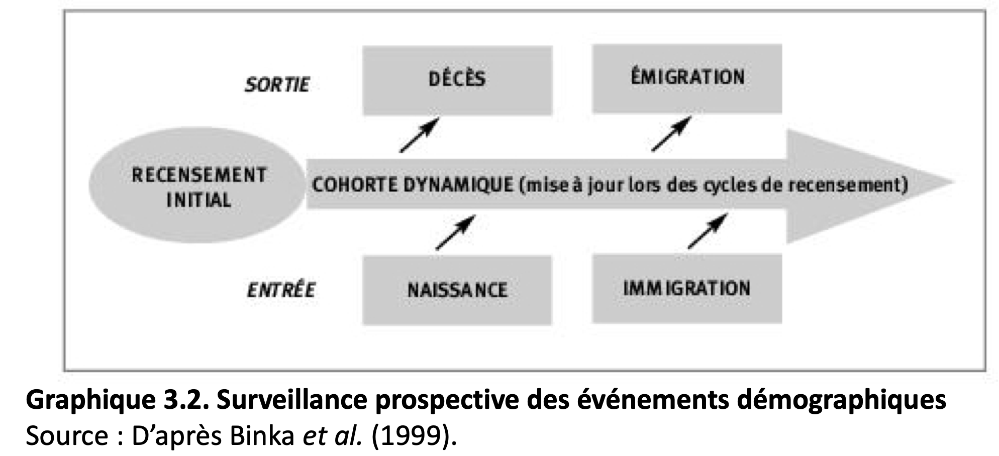

Enquêtes
============================

## Définition

« Opération ayant pour objet l’estimation de certaines caractéristiques dans la totalité de la population à partir de l’observation d’une fraction seulement de cette population dénommée échantillon»

Dictionnaire démographique multi-langue, 1981

## Qu'est ce qu'un échantillon de la population?

«Une population en miniature, qui soit représentative de l’ensemble» (Alfred Sauvy)

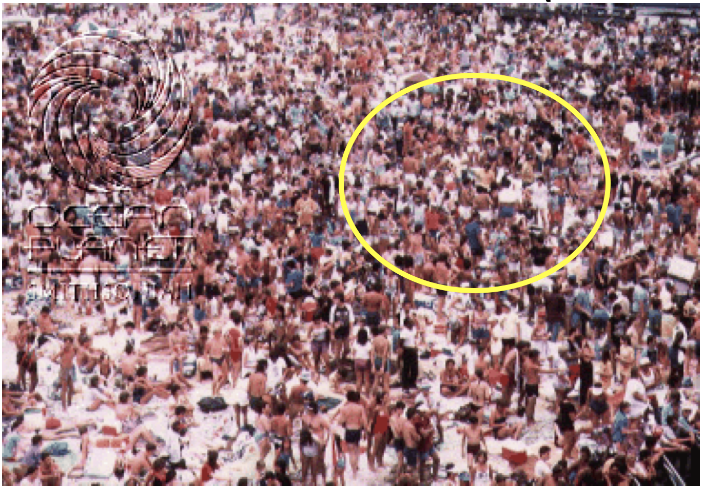

## Caractéristiques

- Portent sur une partie seulement de la population, avec, en général, des procédures garantissant la représentativité de l’échantillon par rapport à la population générale

 - donc beaucoup moins coûteuses

> - Permettent une approche plus approfondie que les recensements : 

> - Grande marge de manœuvre pour construire le questionnaire : quantité de variables, définition des concepts…

## Les deux types d'enquête

1. Enquêtes à un passage: Recueillir des informations pour un échantillon de la population à un moment donné

  - Répondent aux limites des recensements

> 2. Enquêtes à passages répétés:
	Recueillir des informations pour le même échantillon de la population à plusieurs moments
  - Répondent aux limites de l'état civil

## Enquêtes à passage unique

- Principe : on interroge les individus sur les événements de leur vie passée (mariages, naissances, migrations, … )
- Période de référence : courte ou longue (vie entière)

## Enquêtes à passages répétés:

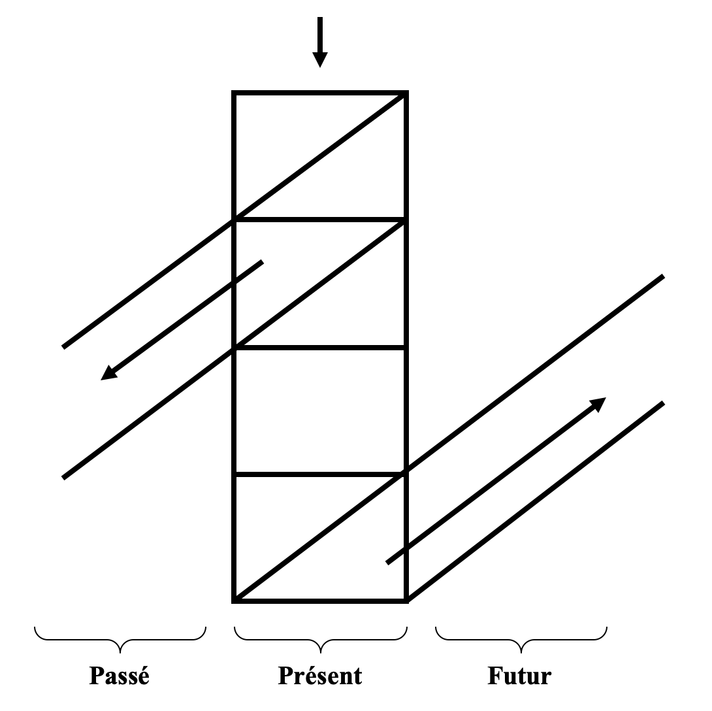

- Enregistrement des informations au fur et à mesure : passages à intervalles réguliers pour enregistrer les événements survenus depuis la visite précédente

## Enquêtes à passage unique

## Avantages des enquêtes

- Analyse longitudinale et transversale

- Mesure possible des tendances de la fécondité, de la mortalité des enfants

- Analyse des déterminants (proches et lointains)

## Limites

- Sélection de la population enquêtée (mortalité, migration)

- Omissions

- Imprécisions: biais possibles dans les estimations des niveaux et des tendances

## Deux exemples canadiens

- Enquête à un passage: Enquête Sociale Générale (ESG)

- Enquête à passages répétés: Enquête nationale longitudinale sur les enfants et les jeunes (ELNEJ)

## Enquête Sociale Générale

- Depuis 1985 rassemble des données sur les tendances sociales, de manière à suivre l’évolution des conditions de vie et du bien-être des Canadiens
- Échantillon: 50000 ménages, âge 15+
- Périodicité: annuelle

- Site web: http://www.statcan.gc.ca/dli-ild/data-donnees/ftp/gss-esg-fra.htm

## L’enquête nationale longitudinale sur les enfants et le jeunes (ELNEJ)

- Depuis 1994, est une étude long terme sur les enfants canadiens qui permet de suivre leur croissance et leur bien-être de la naissance au début de l’âge adulte

- Échantillon: 30000 enfants âgés 0-11 ans lors de leur sélection; en 2005: 30800

- Périodicité: bi-annuelle

- Site web: www.statcan.ca

## Dans les pays développés

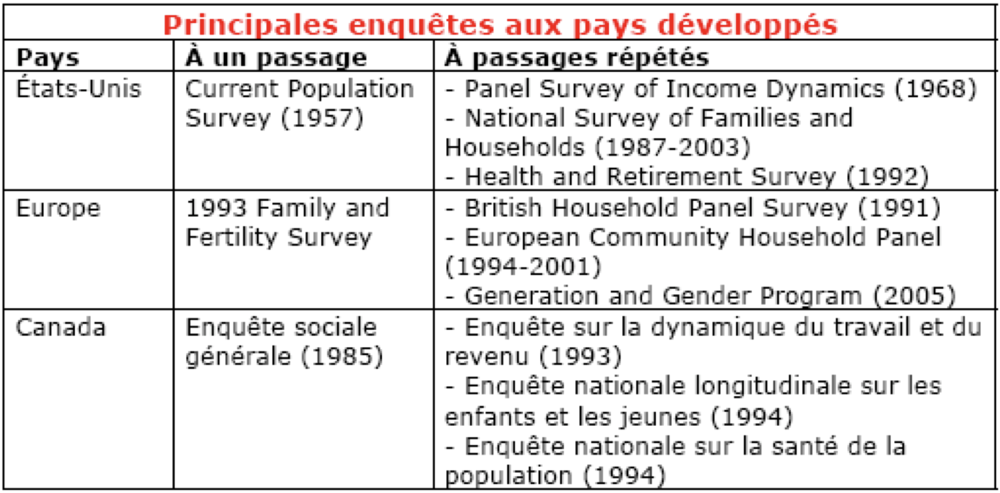

## Les enquêtes dans les pays en développement

- Pour combler les insuffisances ou l’absence des recensements et de l’état civil
- Exception: Sample Registration System en Inde depuis 1950, une série assez régulière d'enquêtes socio-économiques au niveau du pays entier

- Types:

  - À un passage : les plus communes
  - À passages répétés : plus rares et moins larges

## Les enquêtes à un passage dans les pays en développement

- Sont les enquêtes les plus communes parce qu’ils peuvent inclure des $\color{red}{\textbf{questions rétrospectives}}$, c’est-à-dire qu’on peut interroger une seule fois les individus sur leur passé

- Exemple typique: Nombre d’enfants nés vivants ou décédés, qui permet de mesurer la fécondité

## La fécondité: le sujet le plus étudié dans les PED

- 1960: le programme CAP (Connaissance, Attitude et Pratique de la contraception)
- 1970: Enquête Mondiale de Fécondité (EMF)
  - 62 pays dont 42 en développement 
  - 40% de la population mondiale était couvert
- Depuis 1980: Enquêtes Démographiques et de Santé (EDS)
  - Financées par USAID
  - 90 pays en développement
  - 400 enquêtes réalisées

## Les enquêtes à passages répétés dans les pays en développement

- Plus rares parce que trop coûteux

  - Manque d’infrastructure
  - Grande mobilité individuelle

  - Difficile trouver les sujets et les suivre dans leur vie

  - Situation politique instable : difficile de planifier les passages

- Exemple: Kenya and Malawi Diffusion and Ideational Change Project, depuis 1998

## Les enquêtes démographiques et de santé

>
- Programme énorme, par le nombre et l’étendue des enquêtes : plus de 240 enquêtes dans 84 pays.
- Devenu une source majeure de données, notamment en Afrique subsaharienne
>
- Objectifs de base : fécondité (niveaux et déterminants), déterminants de la pratique contraceptive (cap), santé de la mère et de l’enfant. Evolution avec ajout de modules nouveaux, par exemple :  sida, violences conjugales…
>
- Combine des enquêtes à plusieurs niveaux : 

>  - enquêtes individuelle : femmes (15-49 ans), hommes (+ couples)
>  - questionnaire ménage de base
>  - Autres éventuellement : enquêtes communautaires, hiv…

## Les enquêtes démographiques et de santé

https://dhsprogram.com/

## Enquêtes EDS: Points forts

- Grand nombre d’enquêtes disponibles
- Comparabilité des données collectées
- Souvent plusieurs enquêtes par pays (espacement de 5 ans en principe)

- Possibilité d’analyse : étendue dans le temps et dans l’espace
  - comparaisons internationnales
  - tendances par pays/ entre pays

- Possibilité d’analyse : thématiques
  - Grand nombres de thématiques
  - Questions nombreuses pour chacune d’elles
  - Pour la fécondité : 
    - données sur les différentes variables intermédiaires et éloignées
    - données sur les hommes + appariement H/F dans données couples

## Enquêtes EDS: Points forts

- Accessibilité et valorisation des données 
	http://www.measuredhs.com/ 

  - délais rapides (<2ans) : publication rapport, mise à disposition de bases de données  «nettoyées», prêtes à consommer

  - excellentes conditions d’accès aux données : documentation des fichiers, mise à disposition en plusieurs formats, gratuité

  - logiciel de production de statistiques de bases statcompiler

## Enquêtes EDS: limites

- Position de quasi-monopole (conditionne aussi les sujets de recherche)
- Limites de la comparaison
- Nettoyage et facilité d’utilisation des bases peut faire oublier les imprécisions de la collecte
- N’échappent pas aux biais du rétrospectif

  - Sélection de la population enquêtée
  - Erreurs de datation
  - Omissions

## La santé: un sujet d’une importance croissante dans les PED

- 2002: Enquête Mondiale sur la Santé (EMS)
  - Financée par l’OMS
  - 70 pays dont 52 en développement 

>
- Depuis 2001: tests du VIH effectués dans le contexte des EDS
  - La meilleure source de données sur l’infection du VIH maintenant disponible

Les autres sources d'informations
======================================

## Observatoires de population

Enregistrement continu et de longue durée sur une région ou une société aux fins de mesure et de compréhension des changements démographiques

## Observatoires de population

Modalités d’observation

1. Techniques d’observation:
- Enquêtes à passages répétés et fréquents
(tous les trois ou six mois),
- Système d’enregistrement permanent des
événements liés à des enquêtes régulières sur
des sujets divers

2. Durée: 3-15 ans

3. Échantillon: 3000-8000 ménages

## Observatoire de Population: Exemple

1. Matlab, Bangladesh

  - Depuis 1966: un observatoire permanent de population est établi
  - Échantillon: 100000 individus au début
  - Thème : Fécondité, planification familiale, santé de la mère et de l’enfant, Nutrition
  - Au moins 300 chercheurs nationaux ou internationaux jusqu’en 1991, 567 articles publiés

Site web: www.icddrb.org

## Observatoire de Population: Exemple

2. Le réseau INDEPTH (The International Network for Demographic Surveillance of Populations and their Health in Developing Countries)

  - 18 pays, 
  - 34 sites dont 23 en Afrique, 10 en Asie, et 1 en Océanie

- Thématiques: Fécondité, Mortalité (y compris causes de décès), Migration

  - Mortality levels, patterns, and trends
  - Causes of death in developing countries
  - Malaria transmission and mortality
  - Health equity studies
  - Migration and urbanization
  - Reproductive Health

- Site web: www. indepth-network.org

## Les données administratives

- Données des écoles
- Données des centres de santé
- Base de données longitudinales sur l'immigration
  - https://www150.statcan.gc.ca/n1/pub/11-633-x/11-633-x2018011-fra.htm
  - DOnnées fiscales des immigrants + données d'immigration

"La BDIM combine des fichiers de $\color{red}{\textbf{données administratives}}$ sur les admissions d'immigrants et sur les permis de résidence non permanente provenant d'Immigration, Réfugiés et Citoyenneté CanadaNote1 (IRCC) à des fichiers de $\color{red}{\textbf{données fiscales}}$ provenant de l'Agence du revenu du Canada (ARC). Ces données sont disponibles pour des immigrants déclarants admis à partir de 1980. Les dossiers de déclarants sont disponibles pour les immigrants déclarants depuis 1982."

B. Les données digitales
================================

## Introduction

- La dernière décennie a été témoin d’une quantité de plus en plus volumineuse de données numériques produites sur Internet qui décrivent le comportement humain et d’autres objets d’investigation scientifique. 

- Comme le montre la figure ci-dessous, les dernières décennies ont non seulement vu une augmentation de la quantité de données textuelles, mais également une augmentation de la puissance de calcul qui est de plus en plus nécessaire pour l’analyser. 

- Ensemble, ces deux évolutions pourraient potentiellement élargir considérablement le champ de la recherche dans de nombreux domaines.

## Introduction

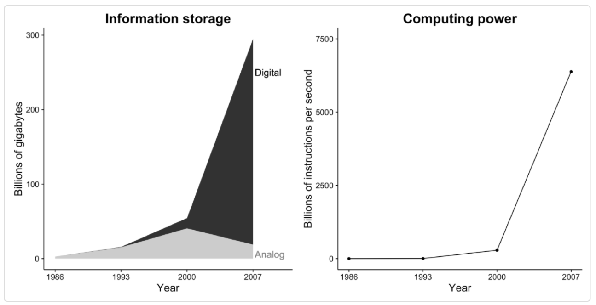

<!--
## Qu'est-ce que les données de trace numériques ou digitales?

[L’invention du télescope a révolutionné l’étude du ciel, de même qu’en rendant mesurable l’énorme mesure, la révolution technologique dans les communications mobiles, sur le Web et sur Internet pourrait révolutionner notre compréhension de nous-mêmes et de nos interactions… . Trois siècles plus tard, Alexander Pope avait soutenu que l'étude appropriée de l'humanité ne devrait pas être dans les cieux, mais en nous-mêmes, nous avons finalement trouvé notre télescope. Que la révolution commence.

—Duncan Watts (2011, p. 266)

## Qu'est-ce que les données de trace numériques ou digitales?

[J]ust as the invention of the telescope revolutionized the study of the heavens, so too by rendering the unmeasurable measurable, the technological revolution in mobile, Web, and Internet communications has the potential to revolutionize our understanding of ourselves and how we interact … . [T]hree hundred years after Alexander Pope argued that the proper study of mankind should lie not in the heavens but in ourselves, we have finally found our telescope. Let the revolution begin.

—Duncan Watts (2011, p. 266)
-->

## Qu'est-ce que les données de trace numériques ou digitales?

- Sites de média sociaux
- Données de recherche Web
- Blogs / Autres forums Internet
- Données administratives sur les sites Web
- Internet Archive
- Numérisation de textes historiques / archives
- Données audio-visuelles
- Données de téléphonie mobile

## Exemples

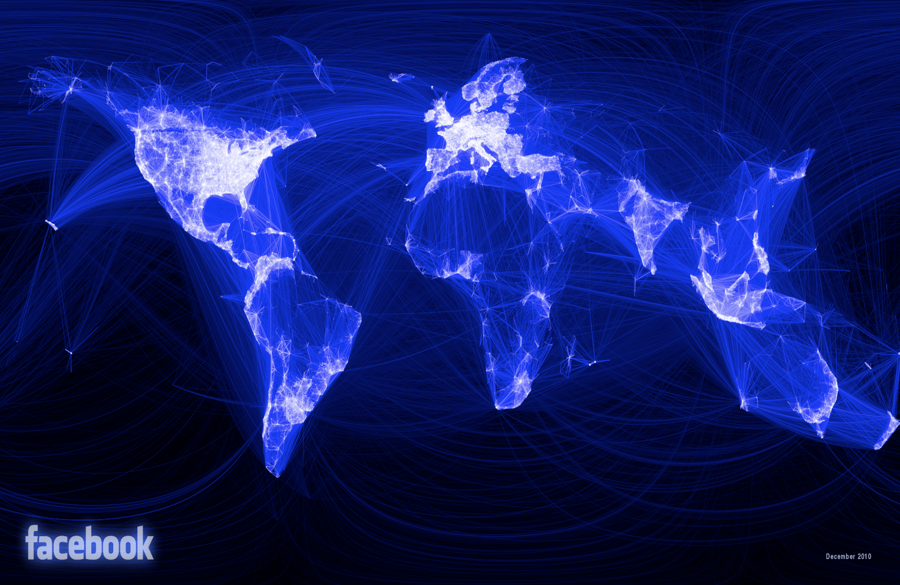

Caractéristiques des données digitales
======================================================

## 1. Volumineux

- Elles sont volumineux
- Pourquoi est-ce important?
  - Étude des phénomènes rares
  - Hétérogénéité: études de Raj Chetty et ses collègues sur la mobilité sociale
  - Détecter des petites différences

##  2. Continue

- L'une des caractéristiques les plus attrayantes des données de trace numériques est leur collecte continue, contrairement aux enquêtes qui ne fournissent généralement qu'un bref instantané du monde social.
- Permet d'étudier des évènements inattendus
- Exemple: Ceren Budak et Duncan Watts (2015) dans l'étude sur les manifestations en Turquie

##  2. Continue

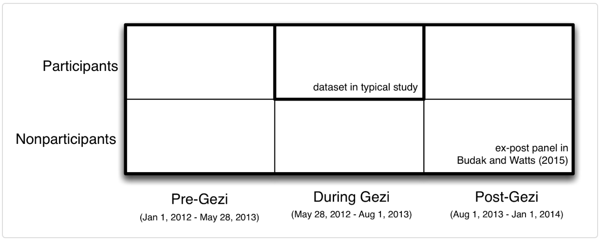

<!--
Figure 2.2: Conception utilisée par Budak and Watts (2015) pour étudier les manifestations d'Occupy Gezi en Turquie à l'été 2013. En utilisant la nature permanente de Twitter, les chercheurs ont créé ce qu'ils ont appelé un panel ex-post qui comprenait environ 30 000 personnes sur deux ans. Contrairement à une étude typique centrée sur les participants pendant les manifestations, le panel ex-post ajoute 1) les données des participants avant et après l'événement et 2) les données des non-participants avant, pendant et après l'événement. Cette structure de données enrichie a permis à Budak et Watts d'estimer les types de personnes les plus susceptibles de participer aux manifestations de Gezi et d'estimer les changements d'attitudes des participants et des non-participants, à court terme (comparaison avec Gezi avant Gezi). ) et à long terme (comparaison de pré-Gezi avec post-Gezi)

-->

##  2. Continue

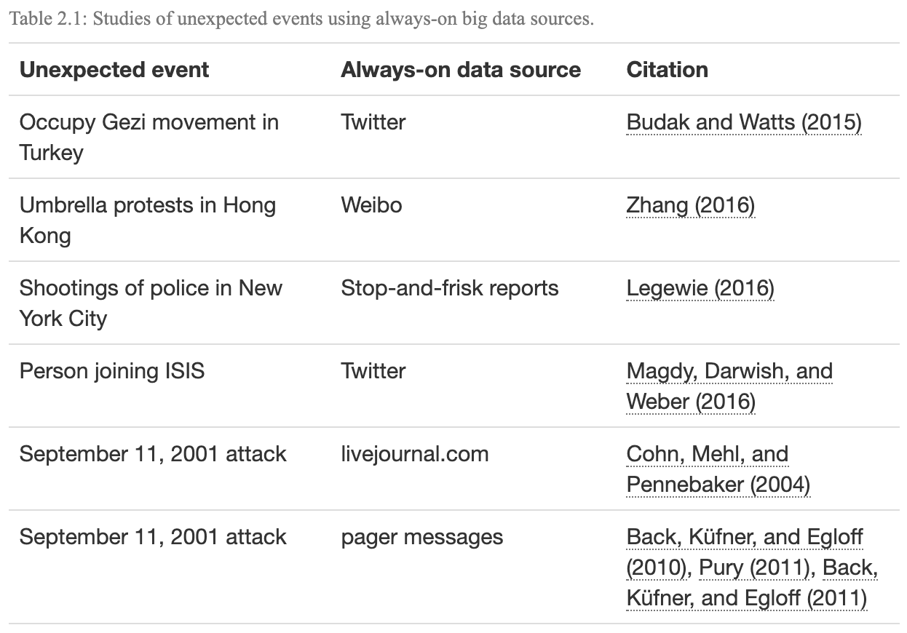

<!--
En plus d'étudier des événements inattendus, les systèmes de données volumineuses permettent également aux chercheurs de produire des estimations en temps réel, ce qui peut être important dans les contextes où les décideurs - au gouvernement ou dans l'industrie - veulent réagir en fonction de la situation. Par exemple, les données des médias sociaux peuvent être utilisées pour orienter les interventions d'urgence en cas de catastrophes naturelles (Castillo 2016) et diverses sources de données volumineuses peuvent être utilisées pour produire des estimations en temps réel de l'activité économique (Choi and Varian 2012) .
-->

## 3. Non réactive

- Un autre avantage important des données de trace numériques est qu'elles sont non réactives ou ne sont pas produites via une interaction entre les chercheurs et ceux qu'ils étudient. 
- Dans certains cas, cela peut entraîner une réduction significative du biais de désirabilité sociale ou d'autres formes d'effet de l'intervieweur. 
- Considérons, par exemple, l’utilisation des données de recherche Google pour étudier l’avortement volontaire (voir la figure ci-dessous).

## 3. Non réactive

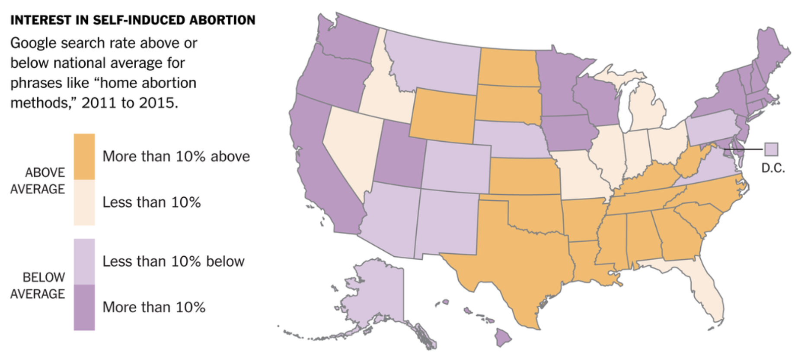

## 4. Capture les relations sociales

- Les données de trace numériques sont également quelque peu inhabituelles dans la mesure où elles décrivent souvent des relations sociales. 
- Alors que les techniques d'enquête classiques ne mesurent généralement que les caractéristiques de sujets individuels, par exemple, les données de trace numériques peuvent souvent être utilisées pour mesurer des relations sociales telles que le réseau de politiciens européens illustré ci-dessous.

## 4. Capture les relations sociales

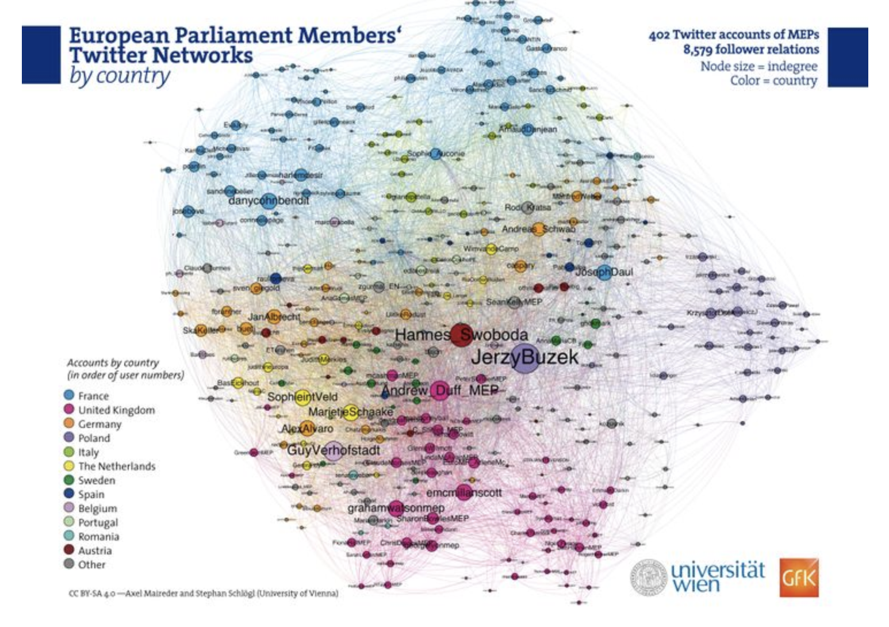

## 5. Incomplet

Bien que la taille et l’échelle des données de traçage numériques pouvant être collectées soient souvent considérées comme un gage, les nouveaux arrivants sur le terrain sont souvent surpris par la quantité de données qui manque souvent ou est incomplète. Prenons, par exemple, une étude sur les comportements d'intimidation sur les réseaux sociaux: bon nombre des publications les plus abusives susceptibles d'intéresser un chercheur sont souvent supprimées par Facebook avant que l'on puisse tenter de les étudier.

## 6. Inaccessible

Un défi encore plus redoutable est que les données sont souvent inaccessibles. Bien que Twitter fournisse une quantité énorme de données accessibles au public, la grande majorité des données générées sur Facebook sont privées. Bien que certaines pages Facebook telles que les "pages de fans" aient des paramètres publics par défaut, la grande majorité des utilisateurs de Facebook définissent leurs paramètres de confidentialité par défaut de manière à ce que les utilisateurs ne puissent accéder à leurs données que s'ils sont affiliés les uns aux autres en tant qu '"amis".

## 7. Non représentatif

Ceux qui souhaitent utiliser des données de trace numériques doivent également faire face à un autre défi majeur: un échantillon aléatoire d'utilisateurs de Facebook ou de Twitter n'est pas représentatif de la population plus large des États-Unis ou de la plupart des autres pays. La figure ci-dessous présente des données du Wall Street Journal sur les données démographiques des utilisateurs de plusieurs sites de médias sociaux, démontrant des différences significatives entre plates-formes en fonction de la race. D'autre part, l'utilisation de Facebook est devenue tellement répandue que certains lecteurs pourraient être surpris de voir à quel point il est devenu plus représentatif du public américain au cours des dernières années.

## 8. Dérive (Drift)

Selon certains analystes, MySpace était autrefois le plus grand site de média social au monde. C’est maintenant qu’il réside dans le cimetière de l’histoire d’Internet, comme tant d’autres sites. Cela augmente le risque de «dérive» dans les données de trace numériques - les plates-formes ne changent pas seulement de popularité (ce qui a bien sûr des implications importantes pour leur représentativité), mais aussi selon qui les utilise et pourquoi. Bien que Facebook fût autrefois la plate-forme la plus populaire pour les étudiants américains de premier cycle, beaucoup d’entre eux se sont tournés vers Instagram ou Snapchat, peut-être en réaction à la hausse de l’utilisation de Facebook par la génération de leurs parents :)

## 9. Algorithmiquement confondant

Parfois, les données de trace numériques qui semblent décrire le comportement humain reflètent en réalité des changements dans la façon dont les humains interagissent avec des algorithmes. La «parabole de Google Flu» en est un exemple populaire. À l'origine, Google Flu était un outil populaire permettant aux utilisateurs d'estimer la prévalence de la grippe à l'aide des données de recherche Google. L'outil était si précis que certains ont suggéré de déplacer les enquêtes officielles des Centers for Disease Control (CDC). Pourtant, au début de 2013, les estimations de Google étaient bien supérieures à celles de la CDC. Des chercheurs ont par la suite découvert que les liens hypertextes liés à la grippe sur laquelle les internautes avaient cliqué apparaissaient dans leur navigateur Web après avoir recherché des informations sur les symptômes du rhume. C'est ce que l'on appelle parfois la dynamique de «l'équipe bleue».

## 10. Non structuré

Les données de trace numériques sont également souvent très désordonnées. Les nouveaux venus sur le terrain pensent souvent que les données générées sous forme numérique sont bien structurées, faciles à rechercher et rapidement transposables dans différents formats. Comme nous le verrons dans les prochains tutoriels, ce n'est généralement pas vrai. Un article récent du New York Times indiquait que les scientifiques du traitement des données consacraient plus de 80% de leur temps à nettoyer les données!

## 11. Sensible

Les données de trace numériques sont également souvent très sensibles. Les récents évènements impliquant Facebook et le cabinet de conseil politique Cambridge Analytica soulignent les dangers d'un accès illimité à de grandes quantités de données de trace numériques, mais il y avait beaucoup plus de violations de données, peut-être plus invasives, bien avant cet évènement récent. Un de ces incidents, illustré ci-dessous, impliquait des chercheurs européens qui avaient extrait des données du site de rencontres Internet OK Cupid, puis avaient rendu publiques leurs données en ligne.

## 12. Biais positif

Enfin, les données de trace numériques ont souvent des dimensions performatives. De nombreuses personnes ne signalent pas d'informations négatives à leur sujet en ligne précisément parce qu'elles savent que leurs amis, leurs collègues ou d'autres personnes qu'elles ne connaissent pas peuvent les surveiller. Cela crée une autre forme commune de biais dans la recherche sur les médias sociaux.

## Exemple: Utilisation des données digitales pour mesurer les phénomènes démographiques

Facebook

- Migration avec les données de Facebook : http://www.zagheni.net/uploads/3/4/4/7/34477700/zagheni_weber_gummadi_2017_accepted_version.pdf
   
- Intégration avec les données de Facebook: https://link.springer.com/chapter/10.1007/978-3-030-01159-8_5

- Utiliser les données des publicités Facebook pour suivre l'écart numérique mondial entre les sexes : https://www.sciencedirect.com/science/article/pii/S0305750X18300883

<!-- https://buffer.com/library/facebook-ads-manager
https://www.facebook.com/business/help/200000840044554?id=802745156580214 -->

<!--
https://www.facebook.com/adsmanager/manage/adsets/edit?act=1488943424583148&selected_campaign_ids=23844034108880350&selected_adset_ids=23844034108900350&root_level=ad_set
-->

## Exemple: Utilisation des données digitales pour mesurer les phénomènes démographiques

Données satellitaires

- https://link.springer.com/chapter/10.1007/978-3-642-39712-7_20
- https://federalnewsnetwork.com/big-data/2019/08/satellite-data-gives-census-a-helping-hand-in-launching-2020-ground-game/
- https://www.unfpa.org/sites/default/files/event-pdf/FINAL-Afghanistan_RS_Project_EB_mtg_2_Feb_17-ajt.pdf

- https://web.flowminder.org/

C. La qualité des données
===============================

## Les sources d’erreurs

Erreurs de couverture (recensement et état civil);

2. Erreurs d’échantillonnage (enquêtes);

3. Erreurs de déclarations;

4. Erreurs dans le traitement des données.

## Erreurs de couverture

Se produisent lorsque certaines catégories de la population:

	– ne sont pas comptées (sous-dénombrement); ou
	– sont comptées plus d’une fois  (surdénombrement).

- Typiques des recensements et de l’état civil;

- Méthodes pour estimer le sous-dénombrement net dans un recensement:
	1. Enquête post-censitaire
	Canada: Enquête de contre-vérification des dossiers (CVD); 
	États-Unis: Post Enumeration Program
	2. Méthodes statistiques

- Taille du sous-dénombrement censitaire dans les pays 	développés: 1-2%

## Erreurs d'échantillonnage

- Se produisent lorsque les données recueillies ne concernent pas toute la population

	– Parfois causées par l’absence de bons	recensements

	– Erreurs d’échantillonnage → biais de sélectivité

- Typiques des enquêtes

## Erreurs de déclaration

Se produisent lorsque les répondants ou les enquêteurs fournissent de façon volontaire ou non des mauvaises informations

- Communes à toutes les méthodes de collectes de données

- Types les plus communs:

	– Erreurs sur l’âge

	– Erreurs liées à l’oubli	 -->    Enquêtes rétrospectives
	
	– Différences entre sujets (ex: homme-femme)

## Erreurs de déclaration- Erreurs sur l’âge

- Quand il n’existe pas de tradition d’état-civil bien établie (ex.: PED), la connaissance de l’ âge est floue et les réponses approximatives

- Age heaping: attirance pour les âges ‘ronds’, finissant par 0 ou 5

- Exagération des âges typiques par
  – jeunes filles pubères, selon qu’elles sont ou non mariées
  – les personnes âgées

## Erreurs de déclaration- Erreurs sur l’âge

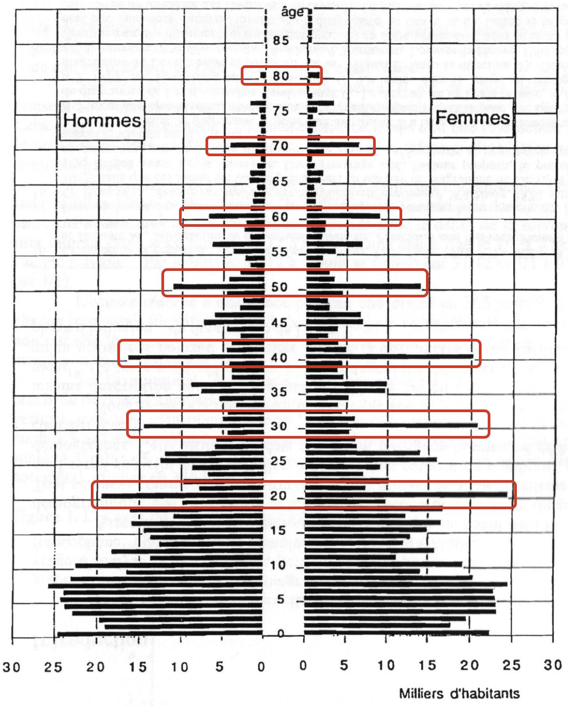

## Erreurs de déclaration: Erreurs liées à l’oubli

- La précision des réponses aux questions sur le passé diminue en fonction de la longueur de la période de référence

- Variables plus ‘sensibles’:

  – Questions sur les migrations (ex.: la durée d’installation)
  
  – Questions sur la mortalité (ex.: le nombre d’enfants décédés)
  
  – Questions sur les dépenses et le revenu (ex.: l’argent dépensé le mois dernier)

## Erreurs de déclaration: Différences entre sujets

- Si on pose les mêmes questions aux hommes et à leur femme, les réponses vont être systématiquement différentes 

## Erreurs dans le traitement des données

- Se produisent lorsque il y a des erreurs de codage, de transfert du questionnaire au support informatique, etc.

- Communes à toutes les méthodes de collecte de données

Pour la semaine prochaine
=========================

## A faire

- Gilles Pison : 1914-2014 : un siècle d’évolution de la pyramide des âges en France (sur Moodle)

