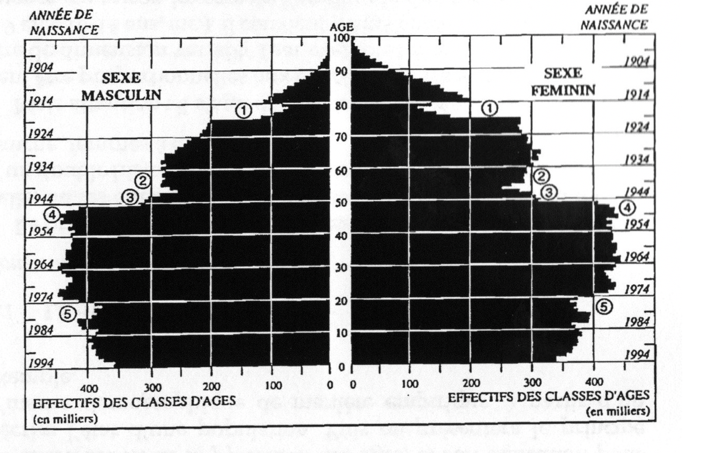
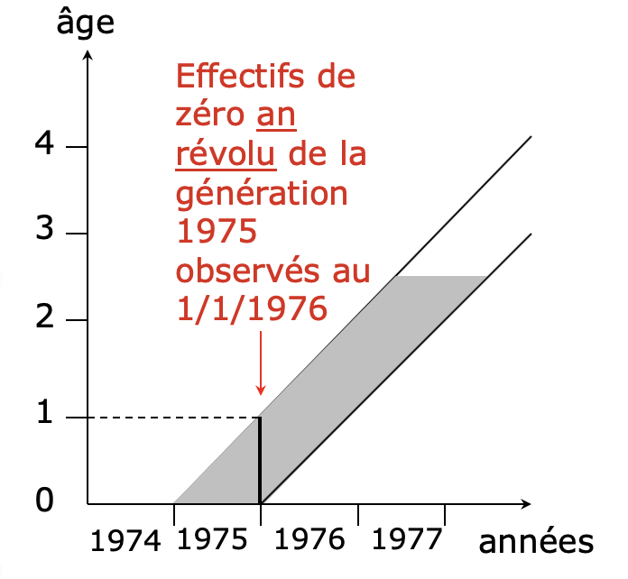

## Ce qu'on a vu la semaine passée

A. Les données usuelles des démographes

1. État Civil

2. Recensement

3. Registre de population

4. Enquêtes 

5. Les autres sources d’informations

B. Les données digitales

C. La qualité des données

## Plan de présentation

1. Pyramide des âges

  - Effectif de la population
  - Construction

2. Rapport de masculinité et ratio de dépendance
  - Rapport de masculinité
  - Ratio de dépendance

3. Diagramme de Lexis

4. Analyse longitudinale / Analyse transversale
  - Représentation
  - Taux et Quotients
  

Introduction
===================================

## L’effectif de la population

- Première donnée sur laquelle porte l’analyse

- Population totale : quelle définition ?

  - Population présente (ou de fait) = physiquement présente au moment de l’observation
  - Population légale (ou de droit) = les individus ayant leur résidence habituelle (c.a.d. qui d’habitude y mangent et dorment) au lieu de l’observation

  - Population présente = population légale - personnes temporairement absentes de leur résidence + personnes de passage

## Les caractéristiques d’une population

- Une **population** est un $\color{red}{\text{ensemble d’individus}}$ auxquels sont associés $\color{red}{\text{différentes caractéristiques}}$

- Exemple : âge, sexe, lieu de résidence, etc..

## Age

- Quel âge avez-vous ? 
- Quand est votre anniversaire?

<!-- Comme pour l’effectif de la population, le problème qui se pose pour l’age est aussi celui de la définition retenue.
-->

## Age

Trois définitions de l’âge d’un individu:

>  - $\color{red}{\textbf{Exact}}$: nombre d’années, mois et jours écoulés depuis sa naissance (ex.: âge exact d’une personne née le 1er janvier 1950 = 70 ans, 0 mois et 22 jours)

>  - $\color{red}{\textbf{Atteint au dernier anniversaire}}$ ou en $\color{red}{\textbf{années révolues}}$ (ex.: 70 ans en années révolues)

>  - $\color{red}{\textbf{Atteint au cours de l’année}}$** (ex.: 71 ans dans l’année, née le 15 juin 1950) = année d’observation - année de naissance

## Age

- Problèmes dans les PED:
  - Asie: âge très bien connu, base de prédictions sur le devenir individuel (astrologie)
  - Méconnaissance dans d’autres aires (ex.: Mali, seule 10% de la population connaît son âge)

- Deux stratégies pour calculer l’âge d’un individu avec précision:

  - Poser des questions sur son âge et son anniversaire
  - Utiliser des groupes d’ âges

La pyramide des âges
=============================================

## Définition

- Schéma de représentation spécifique pour $\color{red}{\text{visualiser la répartition}}$ des effectifs d’une population sur un territoire (pas nécessairement national) selon les deux critères du $\color{red}{\text{sexe}}$ et de l’$\color{red}{\text{âge}}$ à un moment donné.

## Construction

- Histogramme:

  - Axe horizontal (abscisse): 
    - Effectifs, ou
    - Proportions (pour comparer les pyramides des âges de deux populations de taille différente)

  - Axe vertical (ordonnée): 
    - Âge en années individuelles, ou 
    - Année de naissance, ou
    - Groupes d’âges.

- Règle : Chaque catégorie d’âge et de sexe sera représentée par un rectangle dont la surface sera proportionnelle à son effectif ou à sa fréquence

## Construction

## Construction 

- Quelques règles:

  - Homme à gauche, femme à droite
  - Échelle

    - 1% sera représenté par 1 cm
    - 5 ans seront représentés par 1 cm de hauteur

  - Étape
    - Surperficie du rectangle qui représentera le groupe d’âge
    - Quelle est la hauteur de ce rectangle
    - Quelle est la longueur de la base

## Exercice 1: Pyramide à partir des effectifs réels

À partir des données du Tableau 1, construire l’extrait de pyramide des âges correspondant aux groupes d’âges 0-9, 10-19, 20-29, 30-39, 40-49, 50-59, 60-69, 70-79 en utilisant deux méthodes:
  
  1. *Les effectifs réels de la population*
  2. Les proportions que représente chaque groupe d’âge par rapport à la $\color{red}{\text{population totale (de deux sexes)}}$

## Exercice 1: Pyramide à partir des effectifs réels

## Exercice 1: Pyramide à partir des effectifs réels

## Exercice 1: Pyramide à partir des effectifs réels

## Exercice 1: Pyramide à partir des effectifs réels

## Exercice 1: Pyramide à partir des effectifs réels

## Exercice 2: Pyramide à partir des proportions

## Exercice 2: Pyramide à partir des proportions

## Exercice 2: Pyramide à partir des proportions

## Comment choisir l’âge limite?

“… il n’y a pas de recette miracle. Le mieux est sans doute d’essayer d’éviter la constitution d’un chapeau ou, au contraire, celle d’un spaghetti très long et très fin. Pratiquement, dans les pays du Nord, on choisira souvent 100 ans et plutôt 90 voire 80 dans les pays du Sud, sans pour autant exclure définitivement le 100 ”

(Vandeschrick, Christophe, Analyse démographique, p.74)

## Lecture

1. Permet de visualiser:

  - la place relative occupée dans la population par chaque âge ou groupe d’âges (les degrés de la pyramide)
  - l’équilibre entre les sexes (la symétrie par rapport à l’axe vertical)

> 2. Permet de suivre les évolutions démographiques, parce que la structure par âge et sexe d’une population est influencée par les événements du passé

## Lecture

Le profil de la pyramide des âges est déterminé par:
 
> 1. Changements durables
> 2. Variations accidentelles 
  - de la natalité et 
  - de la mortalité

<!--On peut identifié deux formes principales pour les pyramides des ages.
La pyramide dite en accent circonflexe à large base et à flancs rapidement déclinants est caractéristique de pays associant une forte natalité et une forte mortalité à tous les ages: elle correspond au régime démographique dit primitif.-->

## 1. changement durable de la natalité (forme)

- Pyramide des âges en $\color{red}{\text{accent circonflexe}}$
  - Large base et flancs rapidement déclinants
  - Typique des régimes de forte natalité + forte mortalité

## 1. changement durable de la natalité (forme)

## 1. changement durable de la natalité (forme)

- Pyramide des âges en forme d’$\color{red}{urne}$

  - Diminution des naissances par rétrécissement de la base; la mortalité diminue fortement aux âges les plus avancés avec un sommet épaissi;
  - Typique des régimes de basse natalité + faible mortalité

## 1. changement durable de la natalité (forme)

## 2. Variations accidentelles de la natalité et de la mortalité

- sont les $\color{red}{indentations}$ dans la pyramide
- Exemple:
  - des «encoches» symétriques traduisent généralement des fluctuations du nombre de naissances (déficit au moment des guerres, notamment)
  - les déficits masculins résultent souvent de la surmortalité des périodes de guerre

## Population de la France au 1er janvier 1995

## Population de la France au 1er janvier 1995

## Population de la France au 1er janvier 1995

> 1. Déficit des naissances dû à la guerre de 1914-1918 (classes creuses)

> 2. Passage des classes creuses à l'âge de fécondité

> 3. Déficit des naissances dû à la guerre de 1939-1945

> 4. Baby boom

> 5. Baisse de la fécondité

## Autre exemple: population de la Roumanie au 1er juillet 1985

## Autre exemple: population de la Roumanie au 1er juillet 1985

- Outre les éléments observables des guerres et du baby boom, on notera l'anomalie exceptionnelle de 1967
- Qu'est ce qui s'est passé en cette année en Roumanie pour expliquer cet excès de naissance?

## De la pyramide à l’ogive: passage du régime primitif vers le régime moderne

## Pyramide superposé du Québec, 1971,2001 

## Quelques pyramides particulières

- Pyramide des âges de $\color{red}{\text{population stationnaire}}$: la largeur de la base est la même que la largeur du sommet 

## Quelques pyramides particulières

- Population de retraités

## Quelques pyramides particulières

- Population d’étudiants

## Détection des erreurs sur l'âge: Mauritanie 1977

Le ratio de dépendance 
========================================================

## Ratio de dépendance

- Plusieurs définitions

- Rapport entre les individus d’âge inactif (0-19 et 65 ans et plus) et les individus d’âge actif (20-64 ans)

- RD = Effectif (0-19 et 65+) / Effectifs (20-64)

## Ratio de dépendance

## Exemple

- À partir des données du Tableau 1, calculer le ratio de dépendance pour les hommes canadiens en 2002-3.

>  - 0-19 ans & 65+ (inactifs)= 5 803 127
>  - 20-64 ans (actifs)= 9 858 607

>  - RD = 0.5886

## Le ratio de dépendance: Québec, 1971-2051

## Autre formulation

- RD = Effectif (20-64) / Effectif (65+)

- Cette manière de mesurer exprime le vieillissement de la population

## Autre formulation

## Conséquences

- Vieillissement et retraites au NORD

- Scolarisation et santé au SUD

## Une structure par âge avantageuse en Korée, mais ...

## problématique au Nigeria

## Débat : Oldest old support

- Rapport entre les 50-74 ans et les 85 ans et plus. 
- Bien qu’arbitraire, ces groupes définissent les preneurs de soins et les plus âgés de nos sociétés.

## Débat : Oldest old support

Rapport de masculinité
===============================

## Rapport de masculinité ou sex ratio

- Quantifie les dissymétries observées à partir d’une coupe horizontale d’une pyramide des âges

- RM = (Effectif des Hommes) / (Effectif des femmes)

- Représente le nombre d’hommes pour 100 femmes dans la population ou à chaque âge

## Rapport de masculinité

- Rapport de masculinité dans la population:

  - RM = (Effectif masculin/effectif féminin) * 100
  - Ex. (Tableau 1): RM = (15 661 734 / 15 967 943) * 100 = 0,98

>
- Rapport de masculinité à l’âge x:

  - RMx=(Effectif masculinx/effectif fémininx) * 100
  - Ex. (Tableau 1): RM0 = (169 512 / 161 132) * 100 = 105,2

## Rapport de masculinité

- Décroît avec l’âge (Pourquoi?)

<!-- Décroît avec l’âge, du fait de la surmortalité masculine dans certaines générations -->

## Rapport de masculinité

- Proche de 105 à la naissance, en absence de:

  - avortement sélectif des embryons féminins
  - infanticide des jeunes filles
  - déficiences statistiques, liées à la non-déclaration de filles

## Rapport de masculinité

<!-- Discuter du niveau du RM entre Nord et Sud. Plus faible au Sud parce qu’il diminue avec le nombre de naissance et avec l’âge de la femme.-->

Le diagramme de Lexis
=====================================================

## Age, moment et génération

- 3 formes les plus courantes sous lesquelles le temps intervient en démographie:

>  - l’$\color{red}{âge}$ de l’individu quand l’événement se produit
>  - le $\color{red}{moment}$ ou la date à laquelle il se produit
>  - la $\color{red}{génération}$ ou moment de naissance de l’individu concerné par l’événement

## Définition

- Le diagramme de Lexis est le $\color{red}{\text{support graphique}}$ permettant le repérage des faits démographiques en fonction de :
  - l’âge, 
  - du moment et de 
  - la génération.

## Construction

- Diagramme:
  - Axe horizontal (abscisse) --> dates et générations 
  - Axe vertical (ordonnée) --> âge

## Construction

## Construction

- Repérer la date sur l’axe horizontal
- Repérer l’âge sur l’axe vertical

## Construction

## Évènements relatifs à une année

- Tout événement qui se produit durant l’année 1975 est localisé entre les deux verticales
  - anniversaires
  - mariages
  - décès
  - migrations, etc.

## Évènements relatifs à une année

## Évènements relatifs à une génération : ligne de vie d'un individu

- La ligne de vie d’un individu permet de suivre les $\color{red}{\text{événements démographiques}}$ qui le concernent selon les deux dimensions de temps, le temps de calendrier et l’âge anniversaire

## Évènements relatifs à une génération : ligne de vie d'un individu

## Évènements relatifs à une génération

- Entre les lignes de vie de Jeanne et de Marc, on pourrait dessiner la ligne de vie de tous les individus nés durant l’année 1975: ensemble ils forment la $\color{red}{génération}$ 1975

## Évènements relatifs à une génération

## Génération et cohorte 

- Une génération est l’ensemble des personnes nées une année donnée 
- Une cohorte est l’ensemble des personnes qui subissent un même événement au cours de la même période de temps
  - Migrants en 2005
  - Lorsque l’événement est un mariage on parle de $\color{red}{promotion}$

## Génération et cohorte 
  

  
## Effectifs en âge en années révolues

- Les effectifs d’un âge en $\color{red}{\text{année révolue}}$ expriment le nombre de lignes de vie qui traversent le segment vertical correspondant au jour de l’observation et à l’âge considéré 

## Effectifs en âge en années révolues

## Effectifs en âge atteint

- Les effectifs observés à un âge atteint expriment le nombre de lignes de vie qui traversent le segment horizontal correspondant à l’année de l’observation et à l’âge considéré 

<!-- Le principe de construction posé, il importe de comprendre la signification des données reportées à l’intérieur des surfaces délimitées par le diagonales, horizontales et verticales sur le diagramme de Lexis.
-->

## Les quatre types de couplage âge / moment d’observation / génération

> 2

## Les quatre types de couplage âge / moment d’observation / génération

> 1

## Les quatre types de couplage âge / moment d’observation / génération

> 4

## Les quatre types de couplage âge / moment d’observation / génération

> 3

## Application

Labo 3.2

## Diagramme de Lexis: sommaire

- Prend en compte le temps propre aux événements démographiques
- Permet de:
  - classer et répartir les événements selon l’âge, le moment d’observation et la génération (ou cohorte) concernée
  - représenter et de suivre des événements concernant des groupes, cohortes ou ensemble de cohortes

  - Visualiser de façon synthétique un grand nombre d’observations selon les approches longitudinales et transversales

Analyse longitudinale et analyse transversale
========================================================

## Deux types d'oservation

- Le démographe peut privilégier l’examen d’un phénomène à un moment donné (observation ponctuelle)...

## Deux types d'oservation

- ... ou s’intéresser au suivi d’un phénomène à plusieurs moments dans le temps (observation continue)

## Analyse transversale (ou du moment)

- Analyse des événements au cours d’une période donnée, le plus souvent une ou plusieurs années de calendrier
- liée à une connaissance du présent

## Analyse transversale (ou du moment)

## Analyse longitudinale (ou par cohorte)

- Analyse des événements affectant une ou plusieurs générations ou cohortes
- Suppose le suivi d’une génération jusqu’à l’occurrence complète du phénomène observé

## Résumé

Pour compléter les informations:

  - https://ourworldindata.org/age-structure
  - https://www12.statcan.gc.ca/census-recensement/2016/dp-pd/pyramid/pyramide.cfm?geo1=35&geo2=24&year=2016&type=2

## Pour la semaine prochaine

- Blanchet. 2002. Évolutions démographiques et retraites: quinze ans de débats. Population et société, No 383: https://www.ined.fr/fichier/s_rubrique/18774/pop_et_soc_francais_383.fr.pdf

- Beaujot, R., McQuillan, K. et Ravanera, Z. (2007). «Les changements démographiques au Canada d’ici 2017 et après: Un défi en matière de politiques publiques», Horizonz, Volume 9, Numéro 4.

<!--

## Pour la semaine prochaine
  
- **Lecture pour la semaine prochaine**:
  - Vidal, chapitre 2, page 47 - 49
  - Vidal, chapitre 3, page 96 - 117
  - Olivier Thévenon (2008). «Les politiques familiales des pays développés: des modèles contrastés », Population & Sociétés (Bulletin mensuel d’information de l’Institut national d’études démographiques), no 448. https://www.ined.fr/fichier/s_rubrique/19116/448.fr.pdf

-->