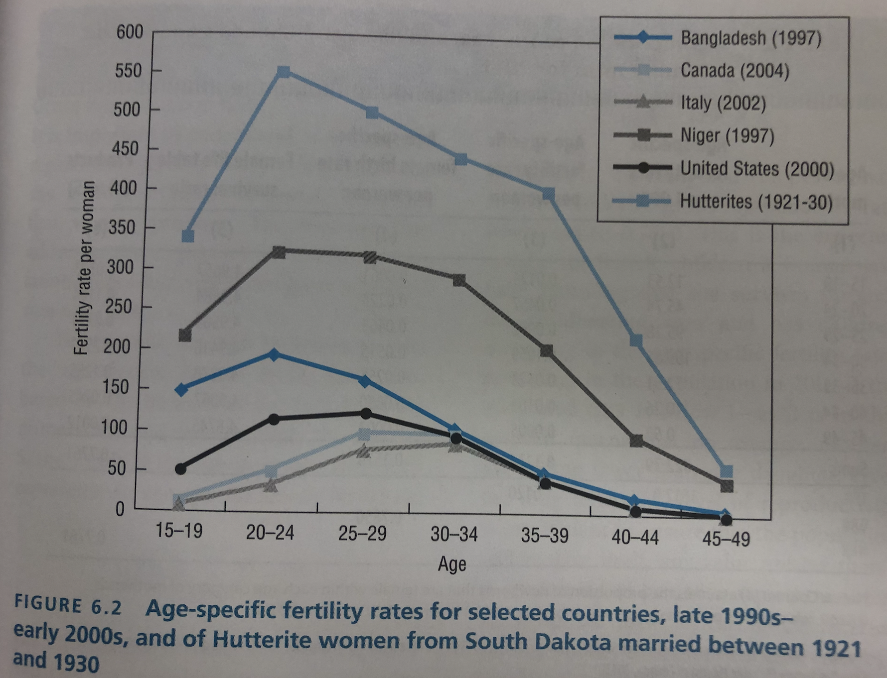
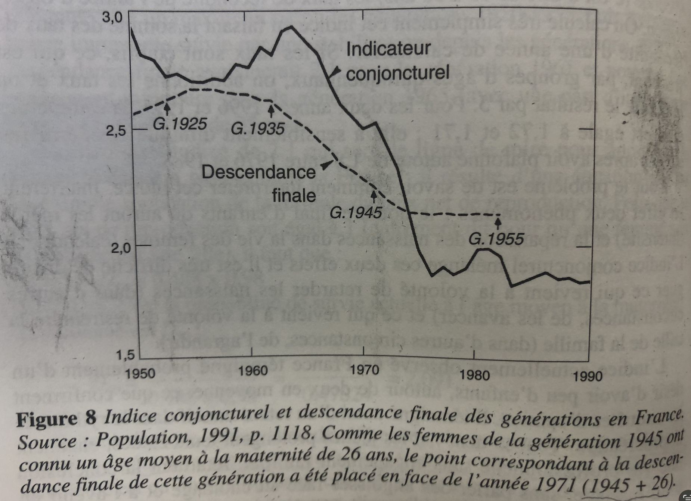
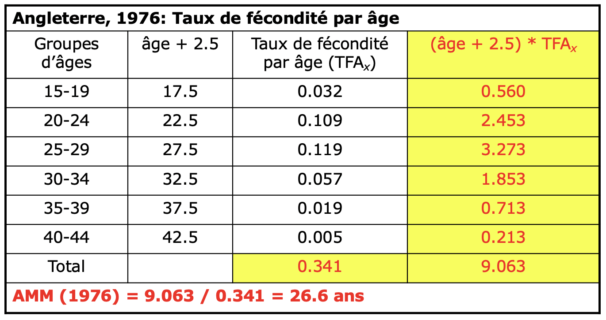
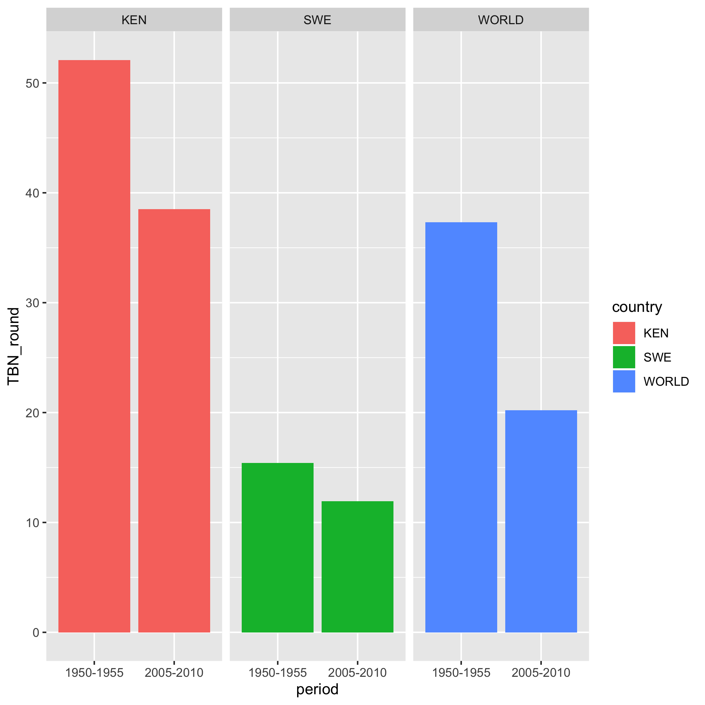
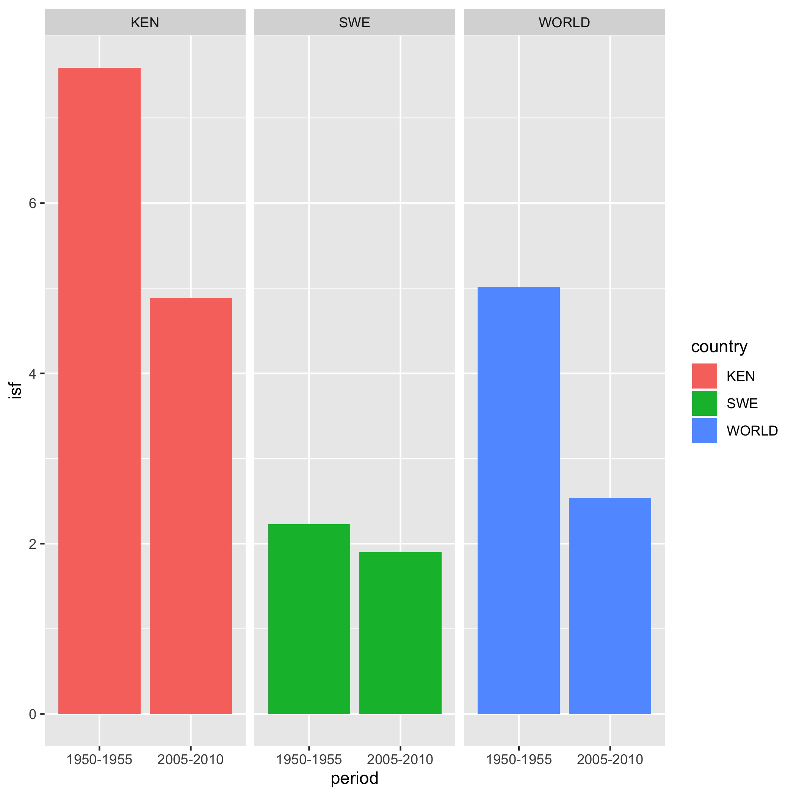
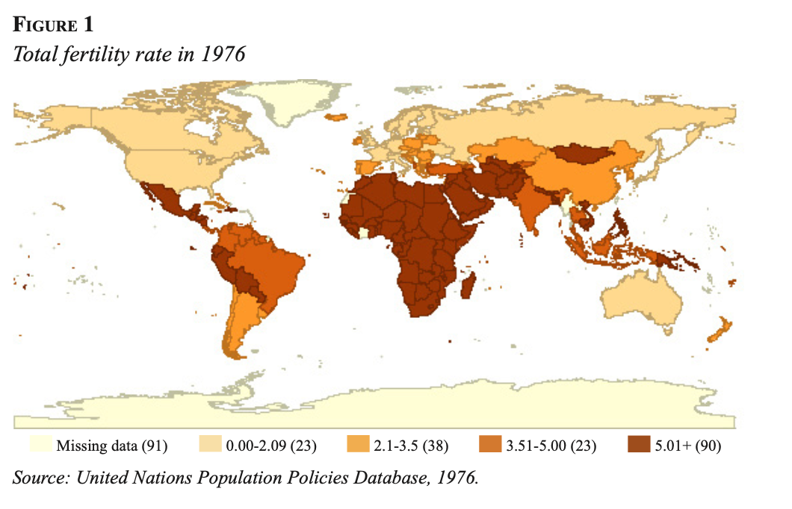
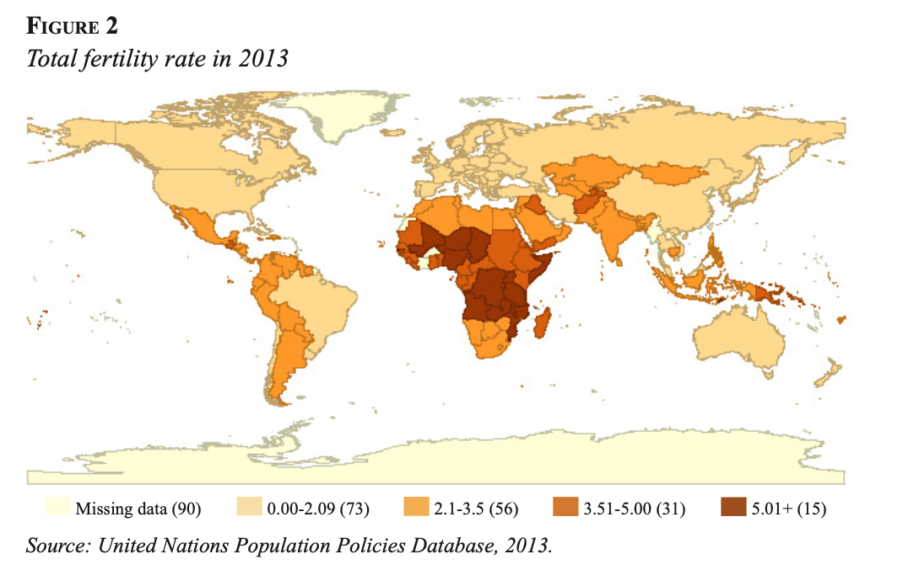
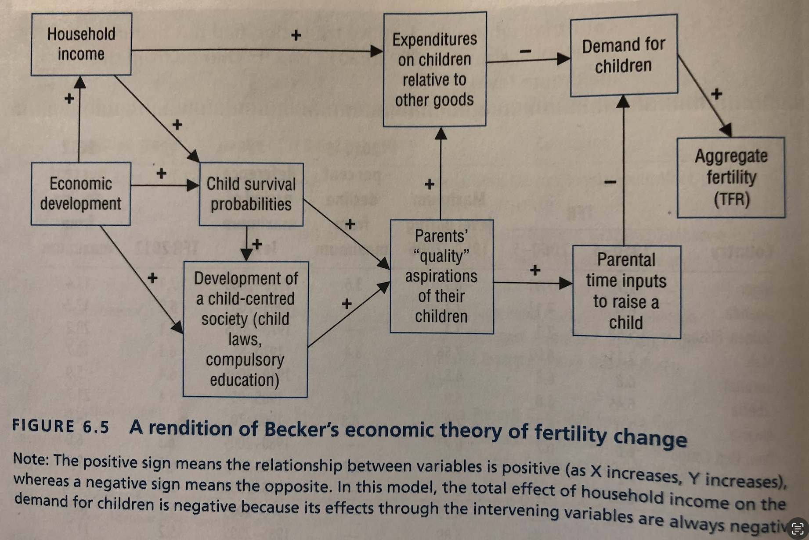

  
## Plan de présentation

1. Introduction
2. Concepts et mesures
3. Évolution des niveaux de fécondité dans le monde
4. Société et fécondité: interactions entre le social et le biologique
5. Déterminants directs de la fécondité
6. Transition de la fécondité
7. Théories du changement de fécondité
8. Conclusion

## Introduction

- Phénomènes démographiques à côté de la mortalité et de la migration
- Évènement associé: Naissance
- Biologique par nature, elle est influencée par :
  - des facteurs culturels et sociétal
  - Fait individuel et collective
- La survie d'une société dépend de la fécondité:
  - existence d'éléments culturels pour promouvoir la fécondité
- La fécondité d'une population est le résultat des facteurs :
    - biologiques
    - sociaux et
    - comportementaux
    
Concepts et mesures
=================================

## Concepts

- Fertilité (fecundity) et fécondité (fertility)

    - La fertilité désigne la capacité biologique d'une homme, d'une femme ou d'avoir des enfants. 
    - Elle dépend de la capacité 
      - de la femme de produire un oeuf capable d'être fécondé
      - de l'homme à produire des spermes
      - La fécondation doit se produire 
      - l'oeuf fécondé doit survivre
      - la grossesse doit aboutir à une naissance vivante
- le contraire de la fertilité est l'infertilité ou la stérilité (infecundity)

## Concepts

- la stérilité peut être génétique ou provenir d'une maladie
- On peut aussi distinguer la stérilité primaire (avant d'avoir conçu) de la stérilité secondaire (survient après une première naissance)
- sous-fertilité (sub-fecundity) désigne la réduction de la capacité des couples à avoir des enfants à cause des problèmes dans les aspects biologiques de la reproduction:
  - inabilité à avoir des rapports sexuels
  - echec dans la conception
  - perte de la grossesse (avortement spontané, mort foetale, mort-né)
  
## Concepts

- la réalisation de la fertilité donne la fécondité
- La fécondité es le reesultat de la reproduction d'un home, une femme ou un couple , mesurée par le nombre des enfants.
- Au niveau agrégé, elle donne une indication de la mesure de la reproduction d'une population.
- La mesure de la stérilitee n'est pas facile dans les sociétés actuelles à cause de la contraception et la steerilisation volontaire.

## Concepts

- Il y a un effet de l'âge sur la stérilité ou l'infertilité
- la fertilité baisse chez les femmes à partir de 40 ans
- la stérilité primaire varie entre 0,6% à 3,4% (données EDS)
- La stérilitee secondaire est plus dispersée: entre 8,7% et 32,6%
  - exposition différentielle aux maladies, spécialement les MST    
  - l'infertilité augmente dans les pays développés
  - varie entre 11% et 26% chez les couples au Canada
  - causé par le report à l'âge `a la première naissance

## Concepts
- Accès à plusieurs procédures médicales:
  - fécondation in vitro
  - médicaments de procréation
  - tests de diagnostiques
  - don d'ovule
  - mère porteuse
  - don de spermes
- Adoption
  
  
## Concepts

- mesure de la stérilité primaire; proportion des gens de 50 ans qui n'ont pas d'enfants
- infertilité (incapacité à donner aissance après un an, deux ans ou trois ans de rapport sexuel)

## Mesures

> - Approche transversale: on rapporte les naissances observées à un moment donnée [par ex déclarées à l’état civil au cours d’une année] aux femmes en âge de procréer observées au même moment [par ex énumérées par le recensement le plus proche à l’année considéré]

> - Approche longitudinale: on rapporte les naissances issues d’une cohorte des femmes aux femmes de la même cohorte [par ex sur la base d’une enquête rétrospective]

## Mesures

- Transversale
  - Taux brut de fécondité (Crude birth rate)
  - Taux général de fécondité (General fertility rate)
  - Taux de fécondité par âge (Age-specific fertility rates)
  - Indice synthétique de fécondité (Total fertility rate)
  - Taux brut de reproduction (Gross reproduction rate)
  - Taux net de reproduction (net reproduction rate)

- Longitudinale
  - descendance finale (Cohort fertility rate)

- Autres mesures
  - Age moyen à la maternité (Mean Age at childbearing)
  
## Mesures

> - Natalité: phénomène en rapport avec les naissances vivantes considérées du point de vue de l’ensemble de la population

> - Fécondité: phénomène en rapport avec les naissances vivantes considérées du point de vue de la population féminine en âge de procréer, c.à.d. de 15 ans (âge légal du mariage dans de nombreux pays) à 50 ans (fin de période de fertilité des femmes).

<!--Les naissance vivantes sont l’événement démographique auquel s’intéresse l’analyse démographique de la procréation.
Quand on étudie la procréation, il y a deux concepts fondamentaux: la natalité et la fécondité.
La natalité est un phénomène en rapport avec les naissances vivantes considérées du point de vue de l’ensemble de la population.
La fécondité est un phénomène en rapport avec les naissances vivantes considérées du point de vue de la population féminine en âge de procréer, c’est-à-dire de 15 ans (âge légal du mariage dans de nombreux pays) à 50 ans (fin de période de fertilité des femmes).

## Mesures de la natalité et de la fécondité

Mesure            Natalité/fécondité
----------------- -----------------------------------------------------
Transversale      1. Taux brut de natalité
                  2. Taux global de fécondité générale
                  3. Taux de fécondité par âge
                    - Indice Synthétique de Fécondité
                    - Taux brut et net de reproduction
                    - Âge moyen à la maternité 
Longitudinale     Taux de fécondité par génération
                    - Descendance finale
                    - Taux brut et net de reproduction
                    - Âge moyen à la maternité 

-->

##  Le taux brut de natalité

$$\text{Taux brut de natalité (TBN)} = \frac{\text{Naissances vivantes}}{\text{Population moyenne}}*1000$$

> - Mesure la fréquence des naissances dans une population à une période donnée

> - En 2005, il varie de 8.5‰ (Allemagne et Lituanie) à 50‰ (Nigeria)

## Le Taux Global de Fécondité Générale (TGFG)

$$TGFG = \frac{\text{Naissances vivantes}}{\text{Population moyenne des femmes de 15-49 ans}}*1000$$

> - Mesure la fréquence des naissances dans la population féminine en âge de procréer (de 15 à 49 ans) à une période donnée

>- Les taux bruts, sont-ils appropriés lors de comparaisons internationales?

## Taux de fécondité par âge

- Taux de fécondité à l'âge x = $TFA_{x}$

$$TFA_{x} = \frac{\text{Naissances vivantes issues des femmes d'âge x}}{\text{Population moyenne des femmes d'âge x}}$$

$$TFA_{x} = f_{x} = \frac{N(x, x+1)}{(P_{x, t} + P_{x, t+1})/2}$$

> - Mesure la fréquence des naissances chez les femmes d’âges x à une période donnée

## Taux de fécondité par âge

## TFA dans le monde

## L’indice synthétique de fécondité du moment

> - Encore appellé : indice conjoncturel de fécondité ou encore somme des naissances réduites

> - Mesure le nombre moyen d'enfants que des femmes auraient au cours de leur vie si, **à tout âge**, leur niveau de fécondité était celui de l'année considérée.

## L’indice synthétique de fécondité du moment

> - Âges en années individuelles

$$\text{ISF (année t)} = \sum_{x = 15}^{49}TFA_{x}$$

> - Groupes d'âges quinquénaux

$$\text{ISF (année t)} = 5*\sum_{x = 15}^{49}TFA_{x, x+5}$$

> - Il s’exprime en enfants par femme

## Application

Age     NNV      PF
------- -------- ---------- 
15-19    13 436  1 072 690
20-24    53 478  1 169 125
25-29   113 628  1 193 839
30-34   124 349  1 174 738
35-39    59 656  1 140 405
40-44    12 207  1 189 542
45-49       708  1 364 982
Total   377 462  7 232 631

NEV: Nombre de naissances vivance
PF: Population féminine
PT: Population total (33 476 688)

## Les taux de fécondité par génération

- Numérateur : les naissances vivantes issues des femmes âgées par exemple entre 20 et 30 ans (25 ans atteints) (parallélogramme EFGH)

## Les taux de fécondité par génération

- Dénominateur : moyenne des effectifs des femmes de la génération ayant 20 ans en le 1e janv. 2007 et 25 ans le 1e 2008 (ligne EH + ligne FG)/2)

<!--

## Les taux de fécondité par génération (suite)

Taux de fécondité à l’âge x  pour les femmes de la génération y (TFAxy) 

$$TFA_{x,y} = \frac{\text{parallélogramme EFGH}}{\text{(ligne EH + ligne FG)/2)}}*1000$$

- EFGH = N.V issues des femmes d'âge x + 1 atteint de la génération y au cours de l'année

- ligne EH = effectif féminin de la génération ayant l'âge x au 1 janvier de l'année

- ligne FG) = effectif féminin de la génération ayant l'âge (x+1) au 1 janvier de l'année suivant

- Mesure la fréquence des naissances chez les femmes d’âges x (15<= x <50 ans) et de la génération y 
-->

## La descendance finale

> - Mesure le nombre moyen d'enfants que les femmes d’une génération y, qui ont vécu jusqu'à 49 ans, ont eu:

> - Il s’exprime en enfants par femme

> - Mesure les comportements d’une génération de femmes arrivées au terme de leur période de procréation

## Déscendance finale

- Mesure le nombre moyen d'enfants que les femmes d’une génération y, qui ont vécu jusqu'à 49 ans, ont eu:
- A partir des taux de fécondité par âge de 1 an:

$$DF (génération y) = \sum_{x = 15}^{49}TFA_{x, y}$$

$$DF (génération y) = TFA_{15, y} + TFA_{16, y} + ... + TFA_{49, y}$$ 

## Déscendance finale

- A partir des taux quinquennaux

$$DF (génération y) = 5*\sum_{x = 15}^{49}TFA_{x, y}$$
$$DF (génération y) = 5*(TFA_{15, y} + TFA_{20, y} + ... + TFA_{45, y})$$ 

## Déscendance finale: Exemple 1

## Déscendance finale: Exemple 1

- DF (génération 1945) = (0,01 + 0,15 + 0,20 + 0,35 + 0,42 + …+ 0,08 + 0,07) = 2,42 enfants par femme

## Taux brut de reproduction

>- Permet de savoir dans quelle mesure une génération est remplacée

>- Il faut que chaque femme donne naissance à au moins une fille.

>- TBR = ISF * 0.488

>- D'où vient les 0.488?

>- On sait que le RM = 1,05 

## Taux net de reproduction

>- Il faut en plus que cette fille survive elle-même pour donner une naissance vivante.

>- Il faut alors tenir compte de la probabilité de survivvre jusqu'à l'âge de la maternité.

>- Si les femmes donnent naissance en moyenne à 29 ans, il faut calculer $S_{29}$

>- $TNR = TBR * S_{29}$

>- D'où vient alors l'idée qu'il faut 2,1 enfant pour assurer le remplacement d'une population?

## L’âge moyen à la maternité d’une génération

>- les mêmes formules s'appliquent.

>- Il suffit de reconstituer les taux de fécondité de la génération (voir labo 5)

## Lien entre indice synthétique de fécondité et descendance finale

> - Indice synthétique de fécondité: synthétise 35 fractions d’histoires fécondes en cours d’écriture par 35 groupes de femmes différents (c’est-à-dire, des générations différentes)

> - Descendance finale: synthétise 35 ans de vie féconde d’un groupe de femmes par cumul des taux de fécondité aux âges successifs

## Quel est le meilleur indicateur

1. Deux phénomènes interfèrent avec l’interprétation de l’ISF du moment: 

  - la répartition des naissances dans la vie des femmes (calendrier) 
  - le nombre final d’enfants qu’auront les mères (intensité)

## Quel est le meilleur indicateur

1. Deux phénomènes interfèrent avec l’interprétation de l’ISF du moment: 

  - la répartition des naissances dans la vie des femmes (calendrier) 
  - le nombre final d’enfants qu’auront les mères (intensité)

2. Très difficile de distinguer ce qui revient:
  - à la volonté de retarder les naissances et
  - à la volonté de restreindre la taille de la famille

## Quel est le meilleur indicateur

L’indice synthétique de fécondité du moment peut s’écarter sensiblement et durablement des descendances finales correspondantes si l’âge moyen à la maternité varie au fil de générations

## Quel est le meilleur indicateur

## L’âge moyen à la maternité: définition

- Âge moyen à la maternité = âge moyen des mères lors des naissances vivantes en l’absence de mortalité

  - du moment: pour une génération fictive des femmes dans une année donnée

  - de génération: pour une génération réelle de femmes qui ont complété leur vie féconde

## L’âge moyen à la maternité du moment

- Calculé à partir des taux de fécondité par âge du moment:

- Âge en années individuelles

$$AMM = \frac{\sum_{x = 15}^{49}(x + 0,5)*TFA_x}{\sum_{x = 15}^{49}TFA_x}$$
$$AMM = \frac{(15 + 0,5)*TFA_{15} + ... + (49 + 0,5)*TFA_{49}}{TFA_{15} + TFA_{16} + ... + TFA_{49}}$$

## L’âge moyen à la maternité du moment

- Calculé à partir des taux de fécondité par âge du moment:

- Âge en groupes d'âges quinquennaux

$$AMM = \frac{\sum_{x = 15}^{49}(x + 2,5)*TFA_x}{\sum_{x = 15}^{49}TFA_x}$$

$$AMM = \frac{(15 + 2,5)*TFA_{15} + ... + (45 + 2,5)*TFA_{45}}{TFA_{15} + TFA_{20} + ... + TFA_{45}}$$

## Exemple

- A partir des données suivantes, calculer l'âge moyen à la maternité

## Exemple

## Exemple

## Exemple

## Exemple

<!--

## L’âge moyen à la maternité d’une génération

- les mêmes formules s'appliquent.
- Il suffit de reconstituer les taux de fécondité de la génération (voir labo 5)

## Exemple

-->

Évolution des niveaux de fécondité dans le monde
========================================================

## Les grandes tendances de la fécondité

1. Jusqu’au XVIIIe siècle, le niveau de la fécondité de tous les pays du monde était déterminé par un ensemble de:
  - pratiques sociales et 
  - d’états sanitaires (la durée de l’allaitement, l’abstinence sexuelle post-partum, l’entrée dans la vie conjugale, l’existence du célibat définitif, etc.) tels que l’on peut parler à leur propos de fécondité naturelle 

>2. Les taux brut de fécondité varient entre 33 pour 1000 et 55 pour 1000 

## Les grandes tendances de la fécondité

- À la fin du XVIIIe siècle, la fécondité commence à être maîtrisée
  - d’abord en France, puis en Europe au cours de XIXe et XXe siècle
  - enfin, au cours des années 1970, dans les autres pays du monde, à l’exception de l’Afrique subsaharienne et des pays musulmans

- Après 1970, dans la plupart des pays développés la fécondité continue à baisser en dessous de 2.1 enfants par femme

## En résumé

- TBF dans le monde

<!--
## TFA dans le monde

-->

## ISF dans le monde

## Évolution de l'ISF dans le monde 1976 - 2013 (Ouedraogo)

- 90 pays ont un ISF de plus de 5 enfants par femme
- 23 pays ont un ISF plus faible que 2.1 enfant par femme (Europe et Amérique)

## Évolution de l'ISF dans le monde 1976 - 2013 (Ouedraogo)

- 15 pays ont un ISF de plus de 5 enfants par femme
- 73 pays ont in ISF plus faible que 2.1 enfants par femme 

4. Société et fécondité: interactions entre le social et le biologique
=======================================================================

5. Déterminants directs de la fécondité
=======================================

## Cadre conceptuel de Blake et Davis

- Cadre méthodologique introduit par Blake et Davis en 1956 (theory of the proximate determinants of fertility):

  **1. Variables intermédiaires, aux travers desquelles s’exerce nécessairement toute influence sur la fécondité**

  2. Variables explicatives ou indépendantes, qui renvoient à la sociologie, l’économie, la politique etc.

## 1. Les variables intermediaires

1. Facteurs biologiques
  - intervalle entre l’âge de la puberté et l’âge de la ménopause
  - fécondabilité et stérilité
  - temps mort

2. Facteurs comportementaux et socio-culturels
  - régime des unions
  - autres variables socio-culturelles
  - variables des régulation de la fécondité

## 1. Facteurs biologiques: Fécondabilité et stérilité

- Fécondabilité = probabilité de concevoir au cours d’un cycle menstruel normal

- Fertilité = capacité de donner naissance à des enfants vivants

- Stérilité = incapacité de donner naissance à des enfants vivants ou de pouvoir procréer à nouveau après avoir eu au moins un enfant

<!--

## Facteurs comportementaux et socio-culturels: Le changement des régimes d’unions et la baisse de la fécondité en Europe après 1970

- Élévation de l’âge du mariage

- Les hommes comme les femmes restent célibataires plus longtemps

- Le taux de divorce augmente
-->

## les déterminants proximaux de Bongaarts

- 4 déterminants proximaux

1. La portée du mariage ;
2. La portée de l'utilisation de contraceptifs ;
3. La portée de l'avortement provoqué ;
4. La portée et la durée de l'allaitement maternel (un indicateur de l'aménorrhée post-partum, c'est-à-dire de l'infécondité après l'accouchement, car l'allaitement agit comme un contraceptif naturel).

## les déterminants proximaux de Bongaarts

$$TFR = C_m * C_c * Ca * C_i * T_F$$

- Cm est l'indice de nuptialité (1 = toutes les femmes en âge de procréer sont mariées ou vivent un type d'union sexuelle similaire ; 0 = aucune femme en âge de procréer n'est mariée ou ne vit un type d'union sexuelle similaire) ;

- Cc est l'indice de non contraception (1 = pas de contraception ; 0 = toutes les femmes fertiles utilisent une méthode efficace à 100 %) ;

## les déterminants proximaux de Bongaarts

$$TFR = C_m * C_c * Ca * C_i * T_F$$

- Ca est l'indice de non-avortement (1=pas d'avortement ; 0=toutes les grossesses sont interrompues) ;

- Ci est l'indice d'infécondité post-partum (1= aucune femme n'allaite et il n'y a pas d'abstinence de coït ; 0=la durée de l'infécondité est infinie - c'est-à-dire que toutes les femmes allaitent et qu'il y a une abstinence totale de coït après une naissance) ; et

- TF est la fécondité totale (c'est-à-dire la fécondité totale maximale), qui est fixée à une valeur moyenne de 15,3 enfants par femme.

## les déterminants proximaux de Bongaarts (Au Canada)

## Cadre de Blake et Davis

- Cadre méthodologique introduit par Blake et Davis en 1956 (theory of the proximate determinants of fertility):

  1. Variables intermédiaires, aux travers desquelles s’exerce nécessairement toute influence sur la fécondité

  **2. Variables explicatives ou indépendantes, qui renvoient à la sociologie, l’économie, la politique etc.**

6. Théories du changement de fécondité
============================================

## Les variables explicatives: l’économie de la fécondité

1. Becker (1960): la théorie du choix rationnel

- Quand ils décident d’avoir un enfant, les gens évaluent si les avantages (monétaires, psychologiques) qu’ils tireront de cet enfant sont supérieurs aux coûts:

  - directs, occasionnés par la présence de l’enfants
    - Santé
    - Éducation…

  - indirects (coût d'opportunité), c-à-d les revenus non perçus à cause de la maternité et de l’éducation des enfants

## Cadre de Becker

## Cadre de Becker

"Appliquée aux sociétés industrialisées d'aujourd'hui, la théorie de Becker impliquerait qu'une faible fécondité est le résultat de l'investissement des parents dans des enfants moins nombreux mais de meilleure qualité. Dans le contexte moderne, les enfants ne sont plus des actifs économiques comme ils l'étaient dans le passé - en fait, ils sont, pour la plupart, des passifs économiques pour leurs parents. Au lieu de cela, leur utilité pour les parents est principalement d'une nature intrinsèquement non matérielle (c'est-à-dire une utilité psychique), qui se manifeste par des avantages intangibles tels que l'épanouissement personnel, le plaisir, le prestige, l'extension de l'image de soi." Trovato, page 221 citant Fawcett, 1983; Hoffman and Hoffman, 1973; Morgan and King, 2001)

## La théorie cyclique de Easterlin

- Constat aux USA su cours du 20e siècle:
  - baisse de la fécondité s'accompagne d'une hausse de la fécondité
  - 1946 jusqu'au milieu des années 60: baby boom aux USA, Canada, Australie et nouvelle Zélande
  - Suivi du "baby bust"

- la baisse de la fécondité dans les années 30, suivie de la hausse de l'après-guerre et ensuite de la baisse à nouveau depuis le milieu des années 1960 représente un modèle de changement cyclique.

## La théorie cyclique de Easterlin

Easterlin attribue cela à une combinaison de facteurs démographiques, sociologiques et économiques

>- l'état de l'économie et la mesure dans laquelle les jeunes adultes ont pu réaliser leurs aspirations matérielles (c'est-à-dire leur revenu par rapport à leurs aspirations matérielles) ;

>- la proportion de jeunes travailleurs par rapport aux travailleurs plus âgés (c'est-à-dire la taille relative de la cohorte et son impact sur les structures d'opportunités des membres de la cohorte) ; et

>- le type de socialisation que les cohortes ont connu pendant leur enfance et leur adolescence (c'est-à-dire la socialisation différentielle des préférences pour les enfants et les aspirations matérielles).

## La théorie cyclique de Easterlin

>- La thèse d'Easterlin implique que le boom de la fécondité de l'après-guerre peut être attribué aux générations d'adultes nés dans les années 1920 et 1930, dont l'enfance et la socialisation adolescente se sont déroulées pendant les jours difficiles de la Grande Dépression, lorsque l'économie s'était effondrée. 

>- En outre, leurs valeurs sociales ont été fortement façonnées par la tradition et l'adhésion à des normes familiales fortes. 

>- Compte tenu de cette combinaison de conditions sociales et économiques, les générations des années 1930 ont développé de fortes préférences pour le mariage précoce et la constitution d'une famille. 

## La théorie cyclique de Easterlin

>- De plus, dans les années 1950 et 1960, au lendemain de la Seconde Guerre mondiale, les économies des pays industrialisés ont connu une période de croissance rapide et la demande de main-d'œuvre était intense. 

>- Pour les jeunes hommes entrant sur le marché du travail, cette situation présentait un concours de circonstances fortuit : les emplois étaient nombreux et les possibilités d'avancement sur le lieu de travail étaient meilleures que jamais. 

>- L'état favorable de l'économie, combiné à l'expérience de socialisation traditionnelle de l'enfance de cette génération et à sa petite taille numérique, a créé un environnement très propice au mariage et à la parentalité précoces. 

>- Ces jeunes adultes pouvaient réaliser leurs aspirations matérielles tout en se conformant aux attentes traditionnelles de se marier jeune et d'avoir beaucoup d'enfants.

## La théorie cyclique de Easterlin

>- La condition économique dans les années 1960, 1970 et 1980 est très défavorable pour le mariage précoce et les naissances

>- ils ont grandi dans la prospérité qui a fait augmenter leur aspirations matérielles

>- cette combinaison de facteurs est non conductible de forte fécondité.

## La théorie contra-cyclique de Butz et Ward

>- Limites de la théorie de Easterlin:

  - Le rôle changeant du statut et du rôle de la femme dans la société depuis les années 1960
  - L'augmentation de l'autonomie financière des femmes
  - Les rôles multiples que les femmes jouent dans la société au-delà du mariage et des naissances

>- Distingue entre le revenu des hommes et des femmes (à la différence de Easterlin qui ne regarde que le revenu des jeunes hommes) et la manière dont chacun affecte la fécondité.

## La théorie contra-cyclique de Butz et Ward

>- L'augmentation du revenu des hommes ==> une augmentation du nombre d'enfants (babyboom est une réponse à l'augmentation du revenu des hommes après la guerre)

>- L'augmentation du revenu des femmes (augmentation de la scolarisation et de la participation économique après 1960) ==> réduction du nombre d'enfants 

>- La résultatnte des deux effets est une réduction du nombre d'enfants

## La théorie contra-cyclique de Butz et Ward

Le fait d'avoir des enfants affecte les coûts d'opportunité des femmes actives d'au moins trois façons :

1. Il y a un effet immédiat sur l'emploi des femmes
2. Il y a des effets à long terme sur la capacité de gain
3. Il en résultera une perte en termes de couverture de pension future.

## Les théories sociologiques: la seconde transition démographique

>D'une manière générale, la deuxième transition démographique fait référence à une situation dans des pays qui ont depuis longtemps traversé la première transition démographique et qui connaissent des changements significatifs dans plusieurs dimensions sociales démographiques clés. Ces changements sont les suivants:

## Les théories sociologiques: la seconde transition démographique

>1. un pluralisme des modes de vie chez les jeunes adultes, accompagné d'une tendance généralisée à retarder le mariage au profit d'unions de cohabitation ;

>2. une baisse du taux de nuptialité ;

>3. l'augmentation des probabilités de divorce ;

>4. des niveaux très élevés d'utilisation de la contraception ;

>5. un taux de fécondité très bas ;

>6. une proportion accrue de couples qui restent sans enfant ; et

>7. une tendance croissante des couples à avoir des enfants en dehors du mariage traditionnel.

## Les théories sociologiques: la seconde transition démographique

>- La transition antérieure a été déclenchée par un énorme investissement sentimental et financier des parents dans l'enfant ; dans ce contexte, les familles plus petites étaient beaucoup mieux adaptées pour renforcer la capacité des parents à s'occuper correctement de leurs enfants.

>- En revanche, la "pénurie de naissances" actuelle a été provoquée par une attitude diamétralement opposée : l'époque de "l'enfant-roi" comme objectif central du mariage et de la famille a cédé la place à l'accomplissement personnel de l'individu, ou au "couple-reine"

## Les théories sociologiques: la seconde transition démographique

>- Les théoriciens de cette école de pensée soulignent l'importance de la post-modernité, du post-matérialisme et des valeurs qui y sont associées et qui sont centrées sur l'éthique de l'individualisme - liberté, expression personnelle, recherche personnelle d'un meilleur mode de vie (réalisation de soi) et détachement des valeurs traditionnelles, de l'autorité institutionnelle et de l'éthique de groupe inscrite dans la religion.

<!--
## Les théories sociologiques: la seconde transition démographique

- Pour van de Kaa (1999:31), ce changement d'orientation des valeurs explique parfaitement les nombreux changements démographiques survenus dans le monde occidental à partir de la seconde moitié du XXe siècle. 

- Il est cohérent avec un mode de vie individualiste dans lequel les gens se sentent libres d'avoir des enfants dans le cadre du mariage ou en dehors, seuls ou avec un partenaire, tôt ou tard dans la vie ; un mode de vie dans lequel il est entendu que le sexe et le mariage ne sont plus étroitement liés, et que la contraception n'est interrompue que pour avoir une conception auto-réalisatrice. 

- Les sociétés post-modernes ont également en commun la nature réflexive du processus d'individuation - un processus de remise en question et de confrontation de soi par les futurs parents. 

- Les couples se demandent généralement si le fait d'avoir des enfants enrichira leur vie. 

- Dans de nombreux cas aujourd'hui, la réponse semble être "non". 

- Mais une fois qu'un couple décide qu'il veut un enfant, il fera tout ce qui est en son pouvoir pour réaliser son désir, même si cela implique de recourir à une assistance médicale par le biais de moyens tels que la fécondation in vitro, la gestation pour autrui et l'adoption (van de Kaa).

-->

## Les théories sociologiques: la thèse individualiste de Lesthaeghe

- Lesthaeghe et Moors (1996): la théorie des valeurs post-matérialistes

>- La faiblesse de la fécondité est due à la montée des valeurs post-matérialistes (c.a.d les valeurs de réussite individuelle, de satisfaction des aspirations personnelles, de libéralisme) et par l’affranchissement à l’égard des superstructures traditionnelles, en particulier la religion

>- MAIS: ceux sont les sociétés libérales de l'Europe du Nord qui ont une fécondité plus élevée que les sociétés plus conservatrices du Sud de l'Europe ==> Changement dans les structures qui servent à réduire l'incompatibilité de la reproduction et de la production

## Les théories sociologiques: la théorie de l'égalité des sexes

>- McDonald (2000): la théorie de l’égalité des sexes

>- Dichotomie entre les institutions qui concernent les gens comme individus (éducation, emploi…) et celles qui considèrent l’individu en tant que membre d’une famille (services aux familles, fiscalité sécurité sociale…)

>- Plus la société adhère à un système familial traditionnel, plus le degré de divergence entre les institutions sociales est fort, et plus la fécondité est faible

>- Exemple des pays d’Europe du Sud, du Japon

## La théorie des flux de richesse de Caldwell

>- Idée centrale: Un enfant a un prix pour les parents (coût) et en retour procure des revenues (transfert vers les parents). Si le flux net est en faveur des parents, alors ils feront beaucoup d’enfants, par contre si ce flux est en faveur des fils, les parents en feraient moins

>- Dans les sociétés peu développées et agraires, le flux intergénérationnel profite aux anciens, ce qui accroit une forte fécondité. 

>- Par contre, plus le niveau de développement augmente, moins les anciens ont besoin des jeunes qui surtout profitent plus qu’ils n’en octroient. 

## La théorie des flux de richesse de Caldwell

>- Malheureusement, les faits n’ont pas corroboré cette théorie de Caldwell (Thane, 1989 ; Kaplan, 1994). 

>- Aujourd’hui, dans plusieurs sociétés développées, il y a une gamme de mesures qui assurent le rôle que peuvent jouer les enfants (maisons de retraite) et donc limite une forte fécondité.

## La théorie des flux de richesse de Caldwell

>- Voici quelques exemples d'avantages monétaires et autres accordés par les enfants à leurs parents :

>- la fourniture par les enfants qui travaillent à leurs parents d'une partie ou de la majeure partie de leur salaire ;

>- la prise en charge des parents âgés ;

>- la perpétuation du nom de famille par la procréation ;

>- l'accomplissement des services religieux nécessaires pour les ancêtres décédés ;

>- l'aide et la sécurité apportées à la famille immédiate et élargie

## La théorie des flux de richesse de Caldwell

## Les variables explicatives: réseaux sociaux et fécondité

- La régulation volontaire des naissances et l’adoption de la contraception dépendent d’un processus de diffusion des comportements à un niveau local et international (Bongaarts and Watkins, 1996)

  - Exemple de la France et de la Grande-Bretagne au XIXe siècle
    - Grande intégration sociale à cause des marchés
    - Importance de la poste dans la circulation de l’information
    - Uniformité de la langue
    - Degré d’hiérarchisation de la société plus prononcé en France

## Les politiques publiques

>- La perspective prédominante prescrite par le modèle classique de réduction de la fécondité est le développement économique. 

>- Toute autre perspective semble irréaliste dans ce contexte, comme en témoigne le slogan : "Le meilleur contraceptif, c'est le développement." 

>- De même, selon Pritchett (1994), les politiques de planification familiale ne visent pas à réduire le désir de fécondité (qui est essentiel pour déclencher le déclin), mais à répondre aux besoins non satisfaits en matière de planification familiale. 

## Les politiques publiques

>- Il convient toutefois de noter que la plupart des théories accordent une place importante aux institutions (familiales ou étatiques) :
 
 > - pour établir les conditions qui favorisent le développement économique, 
 > - réduisent l'influence des normes de fécondité (par exemple, l'âge au mariage), ou 
 > - permettent une meilleure diffusion de l'information ou la fourniture et la circulation de l'innovation. 

## Les politiques publiques

>- Dans les pays développés comme dans les pays en développement, le succès de ces politiques demeure mitigé. 

>- En fait, selon Coale, une condition préalable au déclin de la fécondité légitime est que "la limitation de la fécondité doit entrer dans le 'calcul du choix conscient' - c'est-à-dire que les parents doivent être en mesure d'envisager l'idée qu'ils pourraient choisir, même approximativement, le nombre d'enfants qu'ils mettent au monde." 
>- Ainsi, si la motivation à procréer n'entre pas dans ce schéma conscient, toute politique externe est condamnée à l'échec.

## Les politiques publiques

>- Dans les pays en développement, deux domaines de politiques particulièrement importants sont liés à :
 
 > - l'éducation et à 
 > - la planification familiale. 

>- Les travaux pionniers de Caldwell en Afrique de l'Ouest ont montré l'importance de l'éducation comme moteur du changement en matière de reproduction, que ce soit en donnant aux femmes accès à l'information, en renforçant leur autonomie ou en adoptant de nouvelles valeurs occidentales (Caldwell, 1982). 

## Les politiques publiques

>- Plusieurs études ont en effet montré empiriquement que le niveau d'éducation des femmes est fortement corrélé à leur niveau de fécondité (Bongaarts, 2003 ; Shapiro, 2012). 

>- L'engagement des pays lors de la conférence sur l'éducation de Jomtien en 1990 et de la conférence internationale sur la population au Caire en 1994 a entraîné un investissement accru dans l'éducation pour renforcer l'éducation des femmes et leur pouvoir de décision au sein de leur foyer et de la communauté.

## Les politiques publiques

>- Alors qu'elle a été introduite sans problèmes dans les pays développés, en particulier avec le soutien des États, la planification familiale a rencontré plus de réticences dans les pays en développement à ses débuts. 

>- Elle continue de susciter des questions dans certains pays (Ouedraogo et al., 2018), même si son importance n'a plus besoin d'être démontrée en ce qui concerne le changement de la fécondité, la santé maternelle et infantile, et les opportunités économiques qu'elle crée (DaVanzo & Adamson, 1998). 

>- En effet, selon Bulatao, une politique vigoureuse de planification familiale a contribué à 40% de la baisse de la fécondité, passant de 6 enfants par femme dans les années 1960 à 3 enfants par femme 30 ans plus tard (Bulatao, 1998). 

## Les politiques publiques

>- Le succès économique des économies tigres d'Asie (Corée du Sud, Singapour, Hong Kong, Taïwan et Japon) a également été en partie expliqué par le contrôle de la fécondité. 

>- En Afrique subsaharienne, le Zimbabwe, le Kenya et le Ghana ont été les pionniers d'une politique vigoureuse de planification familiale. Il n'est donc pas surprenant que la transition de la fécondité ait commencé dans ces pays. 
>- Plus récemment, le Rwanda s'est activement engagé dans la promotion de la planification familiale. 
 
 > - Entre 2005 et 2010, l'utilisation de la contraception moderne est passée de 17% chez les femmes mariées ou en union à 52%. 
 > - Dans le même temps, la fécondité a baissé de 25%, passant de 6,1 à 4,6 enfants par femme (Westoff, 2013).

## Les politiques publiques

>- Dans les pays développés, les politiques démographiques visent à augmenter la fécondité au-dessus du niveau de remplacement générationnel. 

>- Ces politiques ne sont pas uniformes dans leur contenu et comprennent un ensemble d'objectifs visant :
 
 > - à augmenter la fécondité, 
 > - à équilibrer le travail et la vie familiale, 
 > - à réduire les inégalités économiques et la pauvreté des familles, 
 > - à prendre en charge et éduquer les enfants, et 
 > - à partager équitablement les tâches familiales (Thévenon, 2008). 

## Les politiques publiques

>- Cependant, la plupart de ces politiques ont tendance à affecter le moment de la naissance (âge à laquelle on donne naissance) plutôt que son intensité (nombre d'enfants). 

>- Selon McDonald (2002, p. 432), "une politique réussie (en matière de fécondité) impliquera très probablement des changements dans l'organisation sociale et économique à une échelle beaucoup plus large."

## Conclusion

## Conclusion

- Y-a-t'il une explication unique?

- Au niveau macro-économique, la transformation économique de la société renferme les germes de la baisse de la fécondité à l'échelle mondiale et peut expliquer le niveau (très) bas de la fécondité en Europe et en Amérique du Nord. En effet, pour Caldwell (2004), le principal facteur ayant conduit à la première baisse de la fécondité, en particulier l'économie de marché libre, a été fortement renforcé par la suite, entraînant une disparité entre les niveaux de fécondité et les exigences du nouvel ordre économique. De toute évidence, une fécondité très basse ou faible s'explique par le système économique mondial dirigé par des politiques économiques libérales qui pourraient, avec le temps, se révéler être la force dominante derrière la faible, notamment très faible, fécondité, et les régimes de protection sociale.

<!--

-------------------------------------------------------------

## Fécondité et développement économique

- Dans les sociétés traditionnelles, la haute fécondité était nécessaire pour compenser la mortalité élevée

- Avec le progrès économique, le coût croissant et la valeur économique déclinante des enfants poussent la fécondité à diminuer

## Fécondité et développement économique

Deux problèmes:

- Expérience des PED

- Baisse de la fécondité dans les pays développés en dessous de 2.1 enfants par femme

Analyse longitudinale et analyse transversale
========================================================

## Deux types d'observation

- Le démographe peut privilégier l’examen d’un phénomène à un moment donné (observation ponctuelle)...

## Deux types d'oservation

- ... ou s’intéresser au suivi d’un phénomène à plusieurs moments dans le temps (observation continue)

## Analyse transversale (ou du moment)

- Analyse des événements au cours d’une période donnée, le plus souvent une ou plusieurs années de calendrier
- liée à une connaissance du présent

## Analyse transversale (ou du moment)

## Analyse longitudinale (ou par cohorte)

- Analyse des événements affectant une ou plusieurs générations ou cohortes

- Suppose le suivi d’une génération jusqu’à l’occurrence complète du phénomène observé

## Analyse longitudinale (ou par cohorte)

## Analyse transversale vis-à-vis analyse longitudinale

> - L’intérêt porté à l’actualité démographique accorde une priorité à l’approche transversale

> - Mais l’approche longitudinale est très importante pour étudier l’évolution des phénomènes démographiques dans le temps et donc évaluer le rapport de causalité entre différents événements démographiques

## Taux et quotients

> - **Taux**: Rapport du $\color{red}{\textbf{nombre d’événements}}$ intervenus au cours d’$\color{red}{\textbf{une période donnée}}$ à la $\color{red}{\textbf{population moyenne}}$ de la période.

> - On distingue:  
>   - des taux bruts, 
>   - des taux par âge et 
>   - des taux de génération.

## Taux et quotients

> - **Quotient**: Rapport du $\color{red}{\textbf{nombre d’événements}}$ survenus dans une $\color{red}{\textbf{cohorte au cours d’une année d’âge}}$ à l’$\color{red}{\textbf{effectif initial}}$ de cette cohorte. 

> - Il représente la $\color{red}{\textbf{probabilité}}$ d’apparition de l’événement dans une population non encore touchée par l’événement.

## Taux entre anniversaires

## Taux entre anniversaires

$$f_x = \frac{E_a + E_b}{(P_x + P^{'}_x)/2}$$

## Taux de génération

## Taux de génération

$$f_x = \frac{E_b + E^{'}_b}{(P_x + P_{x+1})/2}$$

## Quotient entre anniversaires

## Quotient entre anniversaires

$$q_x = \frac{D_a + D_b}{S_x}$$

$$S_x = P_x + D_a$$

$$q_x = \frac{D_a + D_b}{P_x + D_a}$$

## Quotient selon l'âge atteint

## Quotient selon l'âge atteint

$$q_x = \frac{D_a + D^{'}_a}{P_{x-1}}$$

## Labo 4. Exercice 1

## Approche transversale vs longitudinale

> - Approche transversale: on rapporte les naissances observées à un moment donnée [par ex déclarées à l’état civil au cours d’une année] aux femmes en âge de procréer observées au même moment [par ex énumérées par le recensement le plus proche à l’année considéré]

> - Approche longitudinale: on rapporte les naissances issues d’une cohorte des femmes aux femmes de la même cohorte [par ex sur la base d’une enquête rétrospective]

## Les taux de fécondité par génération

- Numérateur : les naissances vivantes issues des femmes âgées par exemple entre 20 et 30 ans (25 ans atteints) (parallélogramme EFGH)

## Les taux de fécondité par génération

- Dénominateur : moyenne des effectifs des femmes de la génération ayant 20 ans en le 1e janv. 2007 et 25 ans le 1e 2008 (ligne EH + ligne FG)/2)

## Les taux de fécondité par génération (suite)

Taux de fécondité à l’âge x  pour les femmes de la génération y (TFAxy) 

$$TFA_{x,y} = \frac{\text{parallélogramme EFGH}}{\text{(ligne EH + ligne FG)/2)}}*1000$$
- EFGH = N.V issues des femmes d'âge x + 1 atteint de la génération y au cours de l'année

- ligne EH = effectif féminin de la génération ayant l'âge x au 1 janvier de l'année

- ligne FG) = effectif féminin de la génération ayant l'âge (x+1) au 1 janvier de l'année suivant

- Mesure la fréquence des naissances chez les femmes d’âges x (15<= x <50 ans) et de la génération y 

## La descendance finale

> - Mesure le nombre moyen d'enfants que les femmes d’une génération y, qui ont vécu jusqu'à 49 ans, ont eu:

> - Il s’exprime en enfants par femme

> - Mesure les comportements d’une génération de femmes arrivées au terme de leur période de procréation

## Déscendance finale

- Mesure le nombre moyen d'enfants que les femmes d’une génération y, qui ont vécu jusqu'à 49 ans, ont eu:
- A partir des taux de fécondité par âge de 1 an:

$$DF (génération y) = \sum_{x = 15}^{49}TFA_{x, y}$$

$$DF (génération y) = TFA_{15, y} + TFA_{16, y} + ... + TFA_{49, y}$$ 

## Déscendance finale

- A partir des taux quinquennaux

$$DF (génération y) = 5*\sum_{x = 15}^{49}TFA_{x, y}$$
$$DF (génération y) = 5*(TFA_{15, y} + TFA_{20, y} + ... + TFA_{45, y})$$ 

## Déscendance finale: Exemple 1

## Déscendance finale: Exemple 1

- DF (génération 1945) = (0,01 + 0,15 + 0,20 + 0,35 + 0,42 + …+ 0,08 + 0,07) = 2,42 enfants par femme

## Intensité de la fécondité selon l’approche transversale: Les taux de fécondité par âge

> - Le taux de fécondité pour les femmes âgées 20-25 ans en 2006 rapporte:

## Intensité de la fécondité selon l’approche transversale: Les taux de fécondité par âge

> - Numérateur: les naissances vivantes issues des femmes d’âge 20-25 ans au cours de 2006 (carré ABCD)

## Intensité de la fécondité selon l’approche transversale: Les taux de fécondité par âge

> - Dénominateur: la population moyenne des femmes d’âge 20-25 ans en 2006 (ligne AD+ligne BC /2)

-->
